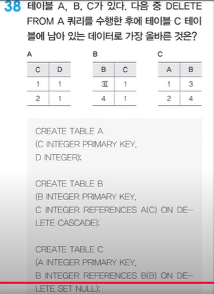

# 📕 SQLD 오답노트 템플릿

---

## ❌ 오답노트 p.214 Q.1

### 📌 문제 요약
> INSERT 문의 성능을 향상시키기 위해 Buffer Cache의 기록을 생략하는 옵션?

### 🧠 내가 고른 답
> 몰라

### ✅ 정답
> 3. Nologging

### 📚 관련 개념 요약
- __Nologging 옵션__ 은 트렌젝션 로그에 대한 기록을 최소화하여 성능을 향상시킬 수 있음.
- 대량의 데이터를 삽입하거나 복사할 때 유용.

### 🔎 정답 근거
- {정답이라고 판단할 수 있는 근거 출처나 페이지, 강의명 등}
---
## ❌ 오답노트 p.214 Q.2

### 📌 문제 요약
> 구조는 삭제하지 않고 모든 데이터를 삭제하는 SQL문은?(테이블의 데이터를 모두 삭제 후 테이블 공간 초기화)

### 🧠 내가 고른 답
> 3. TRUNCATE TABLE EMP;

### ✅ 정답
> 3. TRUNCATE TABLE EMP;

### 📚 관련 개념 요약
- __DELETE FROM 테이블__ 
  - 테이블의 모든 데이터 삭제
  - 데이터가 삭제돼도 테이블 용량 감소하지 않음.
- __TRUNCATE TABLE 테이블__
  - 테이블의 모든 데이터 삭제
  - 데이터가 삭제되면 __테이블의 용량은 초기화__

### 🔎 정답 근거
- {정답이라고 판단할 수 있는 근거 출처나 페이지, 강의명 등}
---
## ❌ 오답노트 p.214 Q.2

### 📌 문제 요약
> 구조는 삭제하지 않고 모든 데이터를 삭제하는 SQL문은?(테이블의 데이터를 모두 삭제 후 테이블 공간 초기화)

### 🧠 내가 고른 답
> 3. TRUNCATE TABLE EMP;

### ✅ 정답
> 3. TRUNCATE TABLE EMP;

### 📚 관련 개념 요약
- __DELETE FROM 테이블__
    - 테이블의 모든 데이터 삭제
    - 데이터가 삭제돼도 테이블 용량 감소하지 않음.
    - 수동 커밋
- __TRUNCATE TABLE 테이블__
    - 테이블의 모든 데이터 삭제
    - 데이터가 삭제되면 __테이블의 용량은 초기화__
    - 자동 커밋
- 둘 다 테이블의 구조는 남기고 값들만을 삭제
### 🔎 정답 근거
- {정답이라고 판단할 수 있는 근거 출처나 페이지, 강의명 등}
---
## ❌ 오답노트 p.215 Q,8

### 📌 문제 요약
> COUNT(*)와 COUNT(MGR)의 차이

### 🧠 내가 고른 답
> 몰라

### ✅ 정답
> 2. NULL 값을 제외하는지 여부

### 📚 관련 개념 요약
- ```COUNT(*)``` 는 NULL 값을 __포함하여__ 카운트.
- ```COUNT(칼럼명)```은 NULL 값을 __제외하고__ 카운트

### 🔎 정답 근거
- {정답이라고 판단할 수 있는 근거 출처나 페이지, 강의명 등}
---
## ❌ 오답노트 p.215 Q,14

### 📌 문제 요약
> 트랜잭션은 자기의 연산에 대해 전부 또는 전무 실행만이 존재, 일부 실행으로는 트랜잭션 기능을 가질 수 없다는 트랜잭션의 특성?

### 🧠 내가 고른 답
> 몰라

### ✅ 정답
> 1. Atomicity(원자성)

### 📚 관련 개념 요약
- __트랜잭션의 특성__
  - __Atomicity(원자성)__ : 트랜잭션 내 모든 작업은 __전부 수행되거나, 전혀 수행되지 않아야 함.__
  - __Consistency(일관성)__ : __데이터데이즈의 제약 조건을 항상 만족해야함__
  - __Isolation(고립성)__ ㅣ 여러 트랜잭션이 동시에 실행돼도 __서로 관련없이 독립적으로 시행__
  - __Durability(지속성)__ : 트랜잭션의 결과는 __영구적으로 반영돼야 함.__

### 🔎 정답 근거
- {정답이라고 판단할 수 있는 근거 출처나 페이지, 강의명 등}
---

## ❌ 오답노트 p.215 Q,14

### 📌 문제 요약
> 트랜잭션은 자기의 연산에 대해 전부 또는 전무 실행만이 존재, 일부 실행으로는 트랜잭션 기능을 가질 수 없다는 트랜잭션의 특성?

### 🧠 내가 고른 답
> 몰라

### ✅ 정답
> 1. Atomicity(원자성)

### 📚 관련 개념 요약
- __트랜잭션의 특성__
    - __Atomicity(원자성)__ : 트랜잭션 내 모든 작업은 __전부 수행되거나, 전혀 수행되지 않아야 함.__
    - __Consistency(일관성)__ : __데이터데이즈의 제약 조건을 항상 만족해야함__
    - __Isolation(고립성)__ ㅣ 여러 트랜잭션이 동시에 실행돼도 __서로 관련없이 독립적으로 시행__
    - __Durability(지속성)__ : 트랜잭션의 결과는 __영구적으로 반영돼야 함.__

### 🔎 정답 근거
- {정답이라고 판단할 수 있는 근거 출처나 페이지, 강의명 등}
---
## ❌ 오답노트 p.218 Q.7

### 📌 문제 요약
> DELETE FROM 과 TRUNCATE FROM에 대한 설명으로 틀린 것은.

### 🧠 내가 고른 답
> 몰라

### ✅ 정답
> 2. ```TRUNCATE TABLE 테이블명``` 은 데이터를 빠르게 삭제하며 로그를 기록한다

### 📚 관련 개념 요약
- ```TRUNCATE TABLE 테이블명``` 
  - 특정 행 삭제 불가
  - 빠르게 삭제하지만 로그 남기지 않음
### 🔎 정답 근거
- {정답이라고 판단할 수 있는 근거 출처나 페이지, 강의명 등}
---

## ❌ 오답노트 p.220 Q.12

### 📌 문제 요약
> 테이블에서 MGR 칼럼값이 NULL이면 "9999"로 출력하는 SELECT문을 작성하시오

### 🧠 내가 고른 답
> 3

### ✅ 정답
> 3
```sql
SELECT NVL(MGR,'9999') FROM EMP;
```

### 📚 관련 개념 요약
- ```NVL(expr1, expr2)``` : expr1이 널이면, expr2 반환
- ```NVL(expr1, expr2, expr3``` : expr1이 not null이면 expr2 / null이면 expr3
- ```NULLIF(expr1, expr2)``` : 두 값이 같으면 NULL / 다르면 expr1 반환
- ```COALESCE(expr1, expr2, ...)``` : 가장 먼저 NOT NULL인 값 반환
### 🔎 정답 근거
- {정답이라고 판단할 수 있는 근거 출처나 페이지, 강의명 등}
---

## ❌ 오답노트 p.220 Q.13

### 📌 문제 요약
> ROWID에 대한 설명으로 올바르지 않은 것은

### 🧠 내가 고른 답
> 3

### ✅ 정답
> 3. ORACLE 데이터베이스가 내부적으로 처리하는 값이기에 개발자가 ROWID 값을 확인할 수 없다.

### 📚 관련 개념 요약
- __ROWID__
  - ORACLE에서 각 행에 부여되는 물리적 주소값
- __특징__
  - 자동 생성
  - 고유성(행마다 유일한 값)
  - 바로 접근 가능(빠름)
  - ```SELECT ROWID FROM EMP```로 확인할 수 있음
### 🔎 정답 근거
- {정답이라고 판단할 수 있는 근거 출처나 페이지, 강의명 등}
---

## ❌ 오답노트 p.220 Q.14

### 📌 문제 요약
> SELECT문의 결과 집합에 따른 가상의 순번은?

### 🧠 내가 고른 답
> 몰라

### ✅ 정답
>  4. ROWNUM

### 📚 관련 개념 요약
- __ROWNUM__
  - 쿼리 결과 집합의 각 행에 대해 부여되는 순번 번호
  - SELECT 결과가 생성될 때 "순서대로" 붙여짐.
  - 1부터 시작
- __주의점__
  - WHERE 조건보다 먼저 부여
  - ```SELECT * FROM WHERE ROWNUM > 1``` -> 결과 생성 x;
### 🔎 정답 근거
- {정답이라고 판단할 수 있는 근거 출처나 페이지, 강의명 등}
---
## ❌ 오답노트 p.224 Q.25

### 📌 문제 요약
> 3개의 테이블을 조인하려면 최소 몇 개의 조건절이 필요한가?

### 🧠 내가 고른 답
> 몰라

### ✅ 정답
> 2. 2개

### 📚 관련 개념 요약
```sql
SELECT *
FROM A,B,C
WHERE A.NO = B.NO
AND B.NO = C.NO;
```
### 🔎 정답 근거
- {정답이라고 판단할 수 있는 근거 출처나 페이지, 강의명 등}
---
## ❌ 오답노트 p.224 Q.27

### 📌 문제 요약
> JOIN을 어떻게 실행할건지에 대한 옵션에 대한 문제

### 🧠 내가 고른 답
> 2. HASH 조인은 EQ JOIN과 NON EQ JOIN에서 사용된다.(틀린 설명)

### ✅ 정답
> 2. HASH 조인은 EQ JOIN과 NON EQ JOIN에서 사용된다.(틀린 설명)

### 📚 관련 개념 요약
- __Nested Loop Join__
  - 작은 테이블 간의 조인
  - __인덱스__ 가 있을 때 -> 인덱스가 있기에 특정 행을 점프해서 읽을 수 있음(```Random Access```)
- __SORT MERGE JOIN__
  - __인덱스__ 가 없을 때
  - 정렬된 상태에서 하나씩 비교하면서 병합
- __HASH JOIN__
  - __인덱스__ 가 없을 때
  - __대용량__
### 🔎 정답 근거
- {정답이라고 판단할 수 있는 근거 출처나 페이지, 강의명 등}
---
## ❌ 오답노트 p.224 Q.28

### 📌 문제 요약
> SQL문과 그에 연결되는 실행 계획에 대한 문제.
```SQL
SELECT * FROM EMP
WHERE EMPNO LIKE '100%'
```

### 🧠 내가 고른 답
> 몰라

### ✅ 정답
> 1. EMP 테이블을 FULL SCAN한 것은 인덱스가 없어서이다.(틀린 정보)

### 📚 관련 개념 요약
- 기본키에는 자동으로 인덱스가 발생
- FULL SCAN이 일어나는 경우
  - 인덱스가 없는 경우
  - 인덱스가 있어도 ```LIKE '%AB``` 등 앞에 와일드카드가 있는 경우
  - EMPNO가 숫자형이기에 형변환이 되어 FULL SCAN된 경우.
  - WHERE절이 없을 때
  - 테이블 크기가 너무 클 떄

### 🔎 정답 근거
- {정답이라고 판단할 수 있는 근거 출처나 페이지, 강의명 등}
---
## ❌ 오답노트 p.228 Q.1

### 📌 문제 요약
> 데이터 모델링의 세가지 관점.

### 🧠 내가 고른 답
> 몰라

### ✅ 정답
> 3. 업무를 처리할 수 있는 프로그램 구성을 어떻게 해야 하는지 분석

### 📚 관련 개념 요약
- 모델링을 할 때 세가지 관점
  - 데이터에 대한 관점
  - 프로세스에 대한 관점
  - 데이터와 프로세스가 서로 연관성이 표현되는 상관 관점

### 🔎 정답 근거
- {정답이라고 판단할 수 있는 근거 출처나 페이지, 강의명 등}
---
## ❌ 오답노트 p.231 Q.16

### 📌 문제 요약
> 엔터티 종류 중의 개념 엔터티에 해당되는 것은?

### 🧠 내가 고른 답
> 4. 주문

### ✅ 정답
> 2. 보험상품

### 📚 관련 개념 요약
- __유무형에 따른 엔터티 종류__
  - 유형 엔터티 : 지속적으로 사용되는 엔터티로 물리적인 형체가 있는 엔터티 (ex:고객,강사,사원 ...)
  - 개념 엔터티 : 물리적 형태가 없는 엔터티 (ex: 거래소 종목, 코스닥 종목, 보험 상품...)
  - 사건 엔터티 : ```비지니스 프로세스```를 실행하면서 생성되는 엔터티 (ex:주문,체결 ...)

### 🔎 정답 근거
- {정답이라고 판단할 수 있는 근거 출처나 페이지, 강의명 등}
---

## ❌ 오답노트 p.235 Q.23

### 📌 문제 요약
> ERD의 관계 표기법으로 올바르지 않은 것은?

### 🧠 내가 고른 답
> 4. 관계 선택사항

### ✅ 정답
> 2. 관계분류

### 📚 관련 개념 요약
- __관계 표기법__
  - 관계명 : 관계를 나타내는 이름
  - 관계차수 : 관련된 관계 인스턴스 수
  - 관계 선택사항 : 관계가 필수인지 선택적인지 나타냄

### 🔎 정답 근거
- {정답이라고 판단할 수 있는 근거 출처나 페이지, 강의명 등}
---

## ❌ 오답노트 p.236 Q.29

### 📌 문제 요약
> 엔터티에 대한 개념 중 엔터티 정의의 공통점 3가지가 아닌 것은

### 🧠 내가 고른 답
> 4. 업무상 관리가 필요한 관심사에 해당된다.

### ✅ 정답
> 2. 데이터베이스 내에서 변별 가능한 객체이다.

### 📚 관련 개념 요약
- __엔터티의 3가지 공통점__
  - 개념,사건,사람,장소 등과 같은 명사
  - 비지니스 프로세스에서 관리되어야 하는 정보
  - 저장이 필요한 어떤 것

### 🔎 정답 근거
- {정답이라고 판단할 수 있는 근거 출처나 페이지, 강의명 등}
---

## ❌ 오답노트 p.230 Q.10

### 📌 문제 요약
> 부모 엔터티로부터 속성을 받았지만, 자식 엔터티의 주식별자로 사용하지 않고 일반적인 속성으로만 사용

### 🧠 내가 고른 답
> 몰라

### ✅ 정답
> 2. 비식별자 관계

### 📚 관련 개념 요약
- __비식별자 관계__ : 부모 엔터티로부터 속성을 받았지만 자식 엔터티의 일반 속성으로만 사용되는 관계
- __식별자 관계__ : 부모 엔터티로부터 받은 속성을 식별자로 사용하는 관계

### 🔎 정답 근거
- {정답이라고 판단할 수 있는 근거 출처나 페이지, 강의명 등}
---

## ❌ 오답노트 p.292 Q.1

### 📌 문제 요약
> 분산 데이터베이스에 대한 설명

### 🧠 내가 고른 답
> 2. 여러 개의 데이터베이스가 존재하므로 관리하기가 어렵다.

### ✅ 정답
> 3. 보안 통제가 쉽고 비용이 절감.

### 📚 관련 개념 요약
- __분산 데이터베이스__
  - 여러 장소에 데이터를 나눠 저장하지만, __사용자는 하나의 DB처럼 사용__
  - __위치/중복/장애 투명성__ 등으로 사용자 입장에서 분산이 감춰짐.
  - __확장성과 장애 허용성__ 이 뛰어나지만
  - __설계, 운용, 일관성 유지__ 가 어렵고, __보안, 비용__ 문제도 있음.

### 🔎 정답 근거
- {정답이라고 판단할 수 있는 근거 출처나 페이지, 강의명 등}
---

## ❌ 오답노트 p.292 Q.2

### 📌 문제 요약
> 데이터베이스 모델링 관점 중에서 CRUD 메트릭스와 관련 있는 것?

### 🧠 내가 고른 답
> 몰라

### ✅ 정답
> 4. 데이터와 프로세스의 상관 관점

### 📚 관련 개념 요약
- __데이터 모델링 관점__ (내용 -> 활동)
  - __데이터 관점__ : 업무에서 사용하는 데이터 -> 구조 분석
  - __프로세스 관점__ : 하는 일 -> 업무 시나리오 분석
  - __데이터와 프로세스의 상관 관점__ : 업무와 데이터 간의 상관 관계 -> CRUD 메트릭스

### 🔎 정답 근거
- {정답이라고 판단할 수 있는 근거 출처나 페이지, 강의명 등}
---

## ❌ 오답노트 p.293 Q.8

### 📌 문제 요약
> 카디널리티를 계산하는 식?

### 🧠 내가 고른 답
> 몰라

### ✅ 정답
> 3. 선택도 * 전체 레코드 수

### 📚 관련 개념 요약
- 카디널리티 계산식 : 선택도 * 전체 레코드 수

### 🔎 정답 근거
- {정답이라고 판단할 수 있는 근거 출처나 페이지, 강의명 등}
---

## ❌ 오답노트 p.293 Q.19

### 📌 문제 요약
> 계층 쿼리의 결과
```
부서코드	상위부서코드
50	0
400	50
150	400
200	150
250	200
```

### 🧠 내가 고른 답
> 몰라

### ✅ 정답
```sql
Select 상위부서코드
from Mytest
where 부서코드 = 400
start with 상위부서코드 = 0
connect by prior 부서코드 = 상위부서코드;
```

### 📚 관련 개념 요약
- 상위부서코드 0부터 시작해서 계층적으로 조회하는데 이때 WHERE 조건으로 부서코드 = 400에 대한 상위부서코드를 찾을 수 있음.
- 계층 쿼리는 ```START WITH ... CONNECT BY ...```로 전개가 완료된 후에 ```WHERE```등의 필터링이 실행

### 🔎 정답 근거
- {정답이라고 판단할 수 있는 근거 출처나 페이지, 강의명 등}
---

## ❌ 오답노트 p.298 Q.22

### 📌 문제 요약
주어진 SQL문과 다른 값을 반환하는 SQL문을 고르시오.

### 🧠 내가 고른 답
> 2. SELECT * FROM MyTEST WHERE(COL1 = 'x' and COL2 = 'y') OR (COL1 ='KK' AND COL2 ='BB');

### ✅ 정답
```sql
SELECT * FROM MyTEST WHERE(COL1 = 'x' and COL2 = 'KK') OR (COL1 ='y' AND COL2 ='BB');
```

### 📚 관련 개념 요약
- ... WHERE(COL1, COL2) IN (('X','Y')); 같은 문은 WHERE문 뒤에 괄호의 순서와 IN 문 안의 괄호의 순서가 대응됨.

### 🔎 정답 근거
- {정답이라고 판단할 수 있는 근거 출처나 페이지, 강의명 등}
---

## ❌ 오답노트 p.298 Q.24

### 📌 문제 요약
정규표현식에서 문자열의 시작과 끝을 의미하는 것은?

### 🧠 내가 고른 답
> 2. [,]

### ✅ 정답
> ^, &

### 📚 관련 개념 요약
- ```^```은 문자열의 시작, ```&```은 문자열의 끝을 의미

### 🔎 정답 근거
- {정답이라고 판단할 수 있는 근거 출처나 페이지, 강의명 등}
---

## ❌ 오답노트 p.298 Q.25

### 📌 문제 요약
DROP TABLE 테이블명 CASCADE CONSTRAIN에 대한 설명으로 옳은 것은?

### 🧠 내가 고른 답
> 몰라

### ✅ 정답
> 4. CASCADE CONSTRAINT 옵션은 해당 테이블에서 참조되는 제약조건도 삭제를 수행한다.

### 📚 관련 개념 요약
- ```CASCADE CONSTRAINT``` 옵션은 해당 테이블에서 참조되는 제약조건도 삭제를 수행한다.
- ```DROP 명령어```는 테이블의 모든 데이터 및 구조를 삭제
- ```CASCADE```는 Oracle에서만 옵션으로 존재.
- ```SQL SERVER```에서는 참조하는 ```FOREIGN KEY``` 제약조건, 참조하는 테이블을 먼저 삭제한 후 해당 테이블을 삭제

### 🔎 정답 근거
- {정답이라고 판단할 수 있는 근거 출처나 페이지, 강의명 등}
---

## ❌ 오답노트 p.300 27

### 📌 문제 요약
SELECT문 실행 결과(NVL, 내장함수 활용)

### 🧠 내가 고른 답
> 4.

### ✅ 정답
> 3.

### 📚 관련 개념 요약
- ```NVL(expr1, 5)``` : expr1이 null일 경우 5로 변경
### 🔎 정답 근거
- {정답이라고 판단할 수 있는 근거 출처나 페이지, 강의명 등}
---

## ❌ 오답노트 p.301 30

### 📌 문제 요약
> WINDOW 함수에 대한 사용 방법으로 옳지 않은 것은?

### 🧠 내가 고른 답
> 1. SUM(급여) OVER()

### ✅ 정답
```sql
SUM(급여) OVER
(PARTITION BY JOB
ORDER BY EMPNO
RANGE BETWEEN
UNBOUNDED PRECEDING
AND UNBOUNDED PRECEDING)
SAL
```

### 📚 관련 개념 요약
- ```UNBOUNDED PRECEDING```은 between과 같은 구문의 ```end point```에 사용될 수 없다.
- ```UNBOUNDED FOLLOWING```은 between과 같은 구문의 ```starte point```에 사용될 수 없다.
### 🔎 정답 근거
- {정답이라고 판단할 수 있는 근거 출처나 페이지, 강의명 등}
---

## ❌ 오답노트 p.301 30

### 📌 문제 요약
> WINDOW 함수에 대한 사용 방법으로 옳지 않은 것은?

### 🧠 내가 고른 답
> 1. SUM(급여) OVER()

### ✅ 정답
```sql
SUM(급여) OVER
(PARTITION BY JOB
ORDER BY EMPNO
RANGE BETWEEN
UNBOUNDED PRECEDING
AND UNBOUNDED PRECEDING)
SAL
```

### 📚 관련 개념 요약
- ```UNBOUNDED PRECEDING```은 between과 같은 구문의 ```end point```에 사용될 수 없다.
- ```UNBOUNDED FOLLOWING```은 between과 같은 구문의 ```starte point```에 사용될 수 없다.
### 🔎 정답 근거
- {정답이라고 판단할 수 있는 근거 출처나 페이지, 강의명 등}
---
## ❌ 오답노트 p.302 31

### 📌 문제 요약
> 파티션에 대한 설명으로 올바르지 않은 것은?

### 🧠 내가 고른 답
```sql
SUM(SAL) OVER
(PARTITION BY MGR
ORDER BY SAL
RANGE UNBOUNDED
PRECEDING)

각 MGR별 현재 행부터 파티션 내 첫번째 행까지의 SAL합을 계산
```

### ✅ 정답
```sql
AVG(SAL) OVER
(PARTITION BY MGR
ORDER BY TODAY
ROWS BETWEEN 1 PRECEDING
AND 1 FOLLOWING)

각 MGR별로 앞의 한 건, 현재행, 뒤의 한 건 사이에서 SAL의 평균을 구한다.
```

### 📚 관련 개념 요약
- 문제 스타일 : 완벽히 맞는 것을 배제한 뒤, 애매한 걸 꼬집어서 틀렸다고 하는 케이스.
- 
### 🔎 정답 근거
- 위의 SQL문은 각 MGR별 ```TODAY 기준으로 정렬했을 때의 파티션```내에서 앞의 한 건, 현재 행, 뒤의 한 건 사이의 급여 평균 계산
---

## ❌ 오답노트 p.302 32

### 📌 문제 요약
> 주어진 결과값에 대하여 알맞은 SQL문은?

### 🧠 내가 고른 답
> 몰라

### ✅ 정답
```
SELECT job_id, MAX(salary) ...
UNION
SELECT job_id, MIN(salary) ...
```

### 📚 관련 개념 요약
- ```UNION vs UNION ALL``` : ```UNION``` -> 중복제거, 정렬 

### 🔎 정답 근거
- ```UNION```의 정렬이 된다의 특성에 따라 결과가 정렬된 꼴이기에 정답임.
---

## ❌ 오답노트 p.303 33

### 📌 문제 요약
> 보기의 SQL문을 실행 했을 때 결과값이 다른 하나는?

### 🧠 내가 고른 답
```sql
SELECT DECODE(a.COL1, null, -1, a.col) as data from Mytest a;
```

### ✅ 정답
```
SELECT CASE a.COL1 WHEN null THEN -1 ELSE 0 END AS data  FROM Mytest a;
```

### 📚 관련 개념 요약
- ```DECODE(expr1,expr2,-1,0)``` : expr1 == expr2 인 경우 expr1 = -1 아니면 expr1 =0

### 🔎 정답 근거

---
## ❌ 오답노트 p.304 35

### 📌 문제 요약
> 다음의 테이블에 데이터 입력 시 에러가 발생하는 것?

```sql
Create table Mytest
(
    A number(10) primary key,
    B number(10),
    C date,
    D varchar2(10)
);
```

### 🧠 내가 고른 답
```sql
INSERT into Mytest values(4,32,20220420,'404');
```

### ✅ 정답
```sql
INSERT into Mytest values(4,32,20220420,'404');
```

### 📚 관련 개념 요약
- ```sysdate-10``` : 10일 전 날짜를 의미
- 20220420이라는 숫자형 값을 바로 DATE에 넣어 ```데이터타입 불일치 에러```가 발생, ```TO_DATE(20220420)```으로 바꿔야 한다.

### 🔎 정답 근거

---

## ❌ 오답노트 p.306 39

### 📌 문제 요약
> 다음의 SQL문을 ANSI 표준 SQL문으로 올바르게 변환한 것은?

```sql
SELECT *
FROM SCOTT.EMO A, SCOTT.DEPT B
WHERE A.DEPTNO = B.DEPTNO
  AND B.DNAME = 'SALES';
```

### ✅ 정답
```sql
SELECT *
FROM SCOTT.EMO A
       JOIN SCOTT.DEPT B
            ON A.DEPTNO = B.DEPTNO
WHERE 1=1 AND B.DNAME = 'SALES';

```

### 📚 관련 개념 요약
- ```WHERE 1=1```은 항상 참인 조건으로 생각하여 문제 풀이(있으나 없으나 결과는 같음)

### 🔎 정답 근거

---

## ❌ 오답노트 p.308 43

### 📌 문제 요약
> 다음의 SQL문을 ANSI 표준 SQL문으로 올바르게 변환한 것은?

```sql
SELECT *
FROM EMP, DEPT
WHERE EMP.부서코드 (+) = DEPT.부서코드;
```

### 🧠 내가 고른 답
몰라

### ✅ 정답
```sql
SELECT *
FROM EMP RIGHT OUTER JOIN
ON (EMP.부서코드 = DEPT.부서코드)
```

### 📚 관련 개념 요약
- 문제에서 주어진 SQL문에서 (+)가 붙은 쪽의 테이블의 행들에 null값이 자동으로 추가됨.
- 결론은 __(+) 붙은 쪽 반대 방향 outer join__

### 🔎 정답 근거

---

## ❌ 오답노트 CBT 1회 2번

### 📌 문제 요약
> 분산 데이터베이스의 투명성에 속하지 않는 것?

### 🧠 내가 고른 답
> 3. 중복 투명성

### ✅ 정답
> 4. 병렬 투명성

### 📚 관련 개념 요약
- __분산 데이터베이스의 투명성__
  - __분할 투명성__
  - __위치 투명성__
  - __지역 투명성__
  - __중복(복제) 투명성__
  - __병행 투명성__
  - __장애 투명성__
### 🔎 정답 근거

---

## ❌ 오답노트 CBT 1회 7번

### 📌 문제 요약
> 결과값을 보고 SQL문의 빈칸에 들어갈 내용을 고르시오.


### 🧠 내가 고른 답
> 4. CUBE(DEPTNO,JOB)

### ✅ 정답
> 1. ROLLUP(DEPTNO,JOB)

### 📚 관련 개념 요약
- ```GROUPING SETS(DEPTNO, JOB)``` : DEPTNO만 JOB만 집계 (각각 따로)
```
| DEPTNO | JOB     | SUM(SAL) |
| ------ | ------- | -------- |
| 10     | NULL    | …        |
| 20     | NULL    | …        |
| NULL   | CLERK   | …        |
| NULL   | MANAGER | …        |
| NULL   | ANALYST | …        |
| NULL   | CLEK    | …        |

```
- ```ROLLUP(DEPTNO, JOB)``` : DEPTNO+JOB -> DEPTNO -> 전체
```
문제출제값
```

- ```CUBE(DEPTNO, JOB)``` : 모든 조함 (DEPTNO+JOB -> DEPTNO -> JOB -> 전체)
```
| DEPTNO | JOB     | SUM(SAL) |                |
| ------ | ------- | -------- | -------------- |
| 10     | CLERK   | 1300     |                |
| 10     | MANAGER | 2450     |                |
| 10     | NULL    | 3750     | ← DEPTNO=10 총합 |
| 20     | CLEK    | 1900     |                |
| 20     | ANALYST | 6000     |                |
| 20     | MANAGER | 2975     |                |
| 20     | NULL    | 9175     | ← DEPTNO=20 총합 |
| NULL   | CLERK   | 1300     | ← CLERK 전체     |
| NULL   | MANAGER | 5425     | ← MANAGER 전체   |
| NULL   | CLEK    | 1900     |                |
| NULL   | ANALYST | 6000     |                |
| NULL   | NULL    | 27549    | ← 전체 총합        |

```
### 🔎 정답 근거

---

## ❌ 오답노트 CBT 1회 12번

### 📌 문제 요약
>  다음 중 자신과 성별이 같은 부양가족을 가진 직원의 이름을 검색하는 질의를 SQL로 적절하게 표현한 것을 고르시오.

### 🧠 내가 고른 답
```sql
SELECT E.이름
FROM 직원 AS E
WHERE E.직원번호 LIKE ( SELECT 직원번호 FROM 부양가족 WHERE E.성별 = 성별);
```

### ✅ 정답
```sql
SELECT E.이름
FROM 직원 AS E
WHERE EXISTS (SELECT * FROM 부양가족 WHERE E.직원번호 = 직원번호 AND E.성별 = 성별);
```

### 📚 관련 개념 요약


### 🔎 정답 근거
* 내가 고른 SQL문의 ```LIKE```는 문자열 패턴 비교 연산자이기에, 직원번호를 비교하는 경우에는 적절치 않음.
```sql
SELECT E.이름
FROM 직원 AS E
WHERE EXISTS (
  SELECT * 
  FROM 부양가족 
  WHERE E.직원번호 = 직원번호 
    AND E.성별 = 성별
);
```
* ```EXIST```는 __부양가족 테이블에 조건을 만족하는 행에 TRUE를 반환__
* ```E.직원번호``` = 직원번호 → 직원과 부양가족이 연결돼 있는지 확인
* ```E.성별 = 성별``` → 성별이 같은 부양가족인지 확인
---

## ❌ 오답노트 CBT 1회 16번

### 📌 문제 요약


### 🧠 내가 고른 답
> 1. 

### ✅ 정답
> 3.

### 📚 관련 개념 요약
- ```group by``` 사용시 주의점
  - __집계 함수(count,min,avg,...)가 아닌 칼럼은 반드시 ```group by```에 포함되어야 한다.__

### 🔎 정답 근거
```sql
SELECT eno, ename, count(*)
FROM employee e, dependent d 
WHERE e.eno = d.eno and count(*) >= 2
GROUP BY d.eno
```
* 1번 선지에서 ```where```절에 ```count(*) >= 2```는 잘못됨.
* ```count()```는 ```group by``` 이후에 ```having```절로 들어가야 함.
```sql
SELECT e.eno, e.ename, t.cnt
FROM employee e,
(SELECT eno, count(*) as cnt
FROM dependent
GROUP BY eno
HAVING count(*) >= 2) t
WHERE e.eno = t.eno;
```
* ```서브쿼리```에서 __부양가족 2명 이상인 직원__ 를 먼저 계산하고
* ```메인쿼리```에서 __두 테이블을 조인__ 하여 완성할 수 있음.
---

## ❌ 오답노트 CBT 1회 20번

### 📌 문제 요약


### 🧠 내가 고른 답
> 4.

### ✅ 정답
> 3.

### 📚 관련 개념 요약
- ```슈퍼타입/서브타입``` 관계테이블 병합
  - __ONE TO ONE TYPE(1:1)__ : 개별 트랜젝션을 개별 테이블로 구성
  - __PLUS TYPE__ : 슈퍼타입+서브타입 테이블로 구성
  - __SINGLE TYPE(ALL IN ONE)__ : 전체를 하나의 테이블로 통합
---

## ❌ 오답노트 CBT 1회 28번

### 📌 문제 요약


### 🧠 내가 고른 답
> 2.

### ✅ 정답
> 4.

### 📚 관련 개념 요약
- ```데이터 모델링```의 세가지 관점
  - __데이터 관점__ : 업무가 어떤 데이터와 관련있는지 또는 데이터 간의 관계는 무엇인지에 대해 모델링 하는 방법(WHAT, DATA)
  - __프로세스 관점__ : 업무가 실제로 하고 있는 일은 무엇인지 또는 무엇을 해야 하는지를 모델링 하는 방법(HOW, PROCESS)
  - __데이터와 프로세스의 상관 관점__ : 업무가 처리하는 일의 방법에 따라 데이터는 어떻게 영향을 받고 있는지 모델링하는 방법(INTERACTION)

---

## ❌ 오답노트 CBT 1회 29번

### 📌 문제 요약


### 🧠 내가 고른 답
> 1.

### ✅ 정답
> 4.

### 📚 관련 개념 요약
| 서브쿼리 유형                    | 주된 역할                                                  | Main Query 값 주입 여부 |
| -------------------------- | ------------------------------------------------------ | ------------------ |
| ✅ Filter형 Subquery         | 필터링 조건 제공                                              | ✅ 주입됨 (보통 상관 서브쿼리) |
| ✅ Early Filter Subquery    | 필터 선행 처리                                               | ✅ 주입됨              |
| ✅ Associative Subquery     | 연관 조건 기반                                               | ✅ 주입됨              |
| ❌ Access Subquery (**정답**) | **MainQuery에서 값 받지 않음**, 독립 실행 → 메인쿼리에게 **값을 제공**하는 구조 | ❌ 주입되지 않음          |

---

## ❌ 오답노트 CBT 1회 32번

### 📌 문제 요약


### 🧠 내가 고른 답
> 3.

### ✅ 정답
> 4.

### 📚 관련 개념 요약
- __동시성 제어__
  - __DBMS는 일반적으로 ```레코드 단위의 락```을 사용__
  - 즉, TX1이 7788번을 갱신중이면 기다렸다가 __TX1의 커밋 이후 값을 기준으로 SAL을 더함__
### 🔎 정답 근거
- 순서 시물레이션
  1. SAL 시작값 : ```1000```
  2. TX1 : ```SAL = SAL + 100``` -> 락 걸림
  3. TX2 : ```SAL = SAL + 200``` -> TX1이 진행중이기에 기다림.
  4. TX1 커밋 -> SAL = 1100
  5. TX2 실행 -> SAL = 1100 + 200 = 1300
  6. TX2 커밋
---

## ❌ 오답노트 CBT 1회 36번

### 📌 문제 요약


### 🧠 내가 고른 답
> 3.

### ✅ 정답
> 1

### 🔎 정답 근거
- SORT MERGE는 인덱스가 없을 경우 사용되며, 두 개의 테이블을 SORT한 뒤에 MERGE 실행
---

## ❌ 오답노트 CBT 1회 38번

### 📌 문제 요약


### 🧠 내가 고른 답
> 1.

### ✅ 정답
> 3.

### 🔎 정답 근거
- ```ROWNUM``` : 첫 행부터 순회하면서 값을 반환하므로 __중간을 건너뛸 수 없다(ex: ROWNUM <= 2 -> TRUE / >= 2 -> FALSE)__
---

## ❌ 오답노트 CBT 1회 39번

### 📌 문제 요약


### 🧠 내가 고른 답
> 5.

### ✅ 정답
> 2.

### 🔎 정답 근거
- ALL 연산자는 서브쿼리 값 모두가 만족하면 ```TRUE```반환
- 이 문제의 경우에 __30,50 모두보다 작아야 하기에 30보다 작은 값들을 출력__
---

## ❌ 오답노트 CBT 1회 41번

### 📌 문제 요약


### 🧠 내가 고른 답
> 1.

### ✅ 정답
> 4.

### 📚 관련 개념 요약
- SQL문에서 NULL과 NULL을 비교할 수 없음.
- NULL값을 조회하려면 ```IS NULL```을 사용해야 함
---

## ❌ 오답노트 CBT 1회 45번

### 📌 문제 요약


### 🧠 내가 고른 답
> 2.

### ✅ 정답
```sql
SELECT 출판사명
FROM 도서
WHERE 발행년도 >= 2000
GROUP BY 출판사명
HAVING COUNT(도서번호) >= 10;
```

### 📚 관련 개념 요약
- ```COUNT()``` 는 ```집계함수``` 이기에 __WHERE절에서 사용할 수 없음__
- | 절          | 역할                  | 집계 함수 사용 가능 |
  | ---------- | ------------------- | ----------- |
  | `WHERE`    | **개별 행** 조건 필터링     | ❌ 불가        |
  | `GROUP BY` | 그룹 만들기              | -           |
  | `HAVING`   | **그룹에 대해 집계 후 필터링** | ✅ 가능        |


---

## ❌ 오답노트 기출 2회 5번

### 📌 문제 요약


### 🧠 내가 고른 답
> 몰라

### ✅ 정답
> 3. 이상현상

### 📚 관련 개념 요약
- ```이상현상``` : 정규화를 하지 않아서 발생하는 문제점
- ```이상현상```의 종류
  - __삽입이상__ : 어떤 데이터를 삽입할 수 없는 상황
  - __삭제이상__ : 하나의 데이터를 삭제했는데, 원하지 않은 다른 정보까지 삭제
  - __갱신이상__ : 중복된 데이터 중 일부만 수정되어 일관성이 깨지는 현상

---

## ❌ 오답노트 기출 2회 11번

### 📌 문제 요약


### 🧠 내가 고른 답
> 4.

### ✅ 정답
> 2.

### 🔎 정답 근거
* 4,8행 -> __DNAME별 소계__
* 1,2,3,5,6,7행 -> __DNAME,SAL 별 소계__
* 9행 -> __전체소계__
---

## ❌ 오답노트 기출 2회 15번

### 📌 문제 요약

### 🧠 내가 고른 답
> 4.

### ✅ 정답
> 4.

### 📚 관련 개념 요약
- ```ORACLE```에서 DDL, DCL은 ```자동 커밋```되고, DML은 안된다.
---

## ❌ 오답노트 기출 2회 17번

### 📌 문제 요약


### 🧠 내가 고른 답
> 몰라

### ✅ 정답
> 3.

### 📚 관련 개념 요약
- ```PL/SQL의 사용 순서```
  1. CURSOR 선언
  2. CURSOR 오픈
  3. FETCH
  4. CURSOR CLOSE
---

## ❌ 오답노트 기출 2회 18번

### 📌 문제 요약


### 🧠 내가 고른 답
> 4.

### ✅ 정답
> 4.
```sql
SELECT TOP(4) WIITH TIES TEAMNAME, WINCNT
FROM TEAMSCORE
ORDER BY WINCNT DESC;
```
### 📚 관련 개념 요약
- ```ROWNUM```은 ORACLE 데이터베이스에서 행 수에 따른 연산을 할 때 사용.
- ```TOP```구는 SQL SERVER에서 사용하고, ```WITH TIES```를 같이 사용하면 동일한 데이터가 있을 때 함께 조회
---

## ❌ 오답노트 기출 2회 20번

### 📌 문제 요약
> SQL에 대한 설명

### 🧠 내가 고른 답

### ✅ 정답


### 📚 관련 개념 요약
```SQL```은 __비절차적__ 언어.
---

## ❌ 오답노트 기출 2회 23번

### 📌 문제 요약


### 🧠 내가 고른 답
> 4.

### ✅ 정답
> 3.

### 🔎 정답 근거
* ```MGR```별로 파티션 구분
* 년도 순으로 정렬
* 자기행 1행 전 ~ 1행 후까지의 합을 더함 (__단, 파티션 별로 넘어가서 계산 하면 안됨__)
---

## ❌ 오답노트 기출 2회 25번

### 📌 문제 요약
> SQL문의 실행 결과?
```sql
SELECT COALESCE(A1, A2) 
FROM (
    SELECT NULL AS A1, 1 AS A2 FROM DUAL
    UNION ALL
    SELECT 1 AS A1, 2 AS A2 FROM DUAL
) A;
```

### 🧠 내가 고른 답
> 몰라

### ✅ 정답
> 3,

### 🔎 정답 근거
| A1   | A2 |
| ---- | -- |
| NULL | 1  |
| 1    | 2  |
* 따라서 1,1이 정답이 됨.

---

## ❌ 오답노트 기출 2회 32번

### 📌 문제 요약


### 🧠 내가 고른 답
> 몰라

### ✅ 정답
> 3.

### 📚 관련 개념 요약
* ```<>```기호는 같지 않다는 뜻.
* NULL <> 'A' 의 결과는 NULL!!

### 🔎 정답 근거
* A.V1을 기준으로 A.V1 = A 일 때는 B.V1 = B 1행
* A.V1 = B 일 때는 B.V1 = A 1행
* A.V1 = C 일 때는 B.V1 = A,B 2행
* 총 4행이 나오고, 그때의 N1값을 더하면 12가 나온다
---

## ❌ 오답노트 기출 2회 34번

### 📌 문제 요약
> 윈도우 함수 GROUP BY구에 대한 설명으로 옳지 않은 것?
> 
### 🧠 내가 고른 답

### ✅ 정답

### 📚 관련 개념 요약
* ```윈도우 함수```는 행의 수를 줄이지 않는다. 각 행에 대해 계산된 값을 새로운 칼럼으로 추가하는 방식으로 작동.

---

## ❌ 오답노트 기출 2회 34번

### 📌 문제 요약
> 데이터베이스 관리 언어를 올바르게 매핑한 것은?
>
### 🧠 내가 고른 답

### ✅ 정답

### 📚 관련 개념 요약
* ```DDL``` : CREATE, DROP, ALTER, RENAME
* ```DML``` : SELECT, INSERT, UPDATE, DELETE
* ```DCL``` : GRANT, REVOKE
* ```TCL``` : COMMIT, ROLLBACK

---

## ❌ 오답노트 기출 2회 37번

### 📌 문제 요약


### 🧠 내가 고른 답
> 3.

### ✅ 정답
> 1.

### 📚 관련 개념 요약
* __PK세팅하는 법 4가지__ :
  1. 테이블 생성시 바로 PK생성하기 (단, PK로 만들 속성이 단일일 경우만 가능)
  ```sql
  CREATE TABLE TEST_A(
  COL1 VARCHAR2(10) PRIMARY KEY,
  COL2 VARCHAR2(10) NOT NULL,
  ...
  );
  ```
  2. 테이블 번저 생성하고 추가로 제약조건 추가
  ```sql
  CREATE TABLE TEST_A(
  COL1 VARCHAR2(10) NOT NULL,
  COL2 VARCHAR2(10) NOT NULL,
  ...
  );
  ALTER TABLE TEST_A ADD CONSTRAINT PK_TEST_A PRIMARY KEY (COL1);
  ```
  3. 테이블 생성과 동시에 PK설정 (PK로 만들 속성 개수 상관 없음)
  ```sql
  CREATE TABLE TEST_A(
  COL1 VARCHAR2(10) NOT NULL,
  COL2 VARCHAR2(10) NOT NULL,
  PRIMARY KEY(COL1)
  );
  ```
  4. 테이블 생성과 동시에 PK 설정(PK로 만들 속성 개수 상관없음, 이름 지정 가능)
  ```sql
  CREATE TABLE TEST_A{
  COL1 VARCHAR2(10) NOT NULL,
  COL2 VARCHAR2(10) NOT NULL,
  CONSTRAINT PK_TEST_A PRIMARY KEY(COL1)
  );
  ```

---
## ❌ 오답노트 기출 2회 38번

### 📌 문제 요약


### 🧠 내가 고른 답
> 몰라

### ✅ 정답
> 2.

### 📚 관련 개념 요약


---
## ❌ 오답노트 기출 2회 44번

### 📌 문제 요약

### 🧠 내가 고른 답
> 

### ✅ 정답
> 

### 📚 관련 개념 요약
* ```LEAD(대상 속성, 순서, 디폴트값``` : LEAD는 순서만큼 뒤의 행의 값을 넣고, 존재하지 않으면 디폴트 값을 가지도록 함,

---

## ❌ 오답노트 기출 2회 46번

### 📌 문제 요약


### 🧠 내가 고른 답
> 1.

### ✅ 정답
> 2.

### 📚 관련 개념 요약
* ```nullif(epxr1, expr2)``` : expr1 == expr2 이면 null 반환, 아니면 expr1 반환

### 🔎 정답 근거
* nullif(1,1) -> null
* __COALESCE(null,200,300) = 200__
---

## ❌ 오답노트 기출 2회 47번

### 📌 문제 요약


### 🧠 내가 고른 답
> 1.

### ✅ 정답
> 4.

### 📚 관련 개념 요약
* ```LPAD(대상문자, 지정 길이, 채울문자)```
* EX) SELECT LPAD('1',8,'0') -> 00000001

### 🔎 정답 근거
* LPAD(EXTRACT(month from sysdate, 2, '0') -> 02
---


