# Servlet and JSP
## day 1 - 웹 서버 프로그래밍
### 1. 정적 웹 페이지와 그 한계
* 초창기 웹이 출현했을 때는 정적(static)인 웹 페이지 만으로 충분했다
* 하지만 __정적 웹 페이지는 내용이 이미 정해져 있기 때문에, 각각 사용자의 요구를 맞출 수가 없음.__

### 2. 웹 서버와 WAS
* ```웹 서버```는 클라이언트의 요청을 받아 __정적인 요소__ (HTML,CSS,JavaScript 파일, 이미지 등)을 제공하는 역할.
* ```WAS```는 웹 서버의 기능을 포함하면서 __동적인 요소__ (데이터베이스 연동 등)를 처리하여 클라이언트에게 제공하는 역할.
* ```웹 서버와 WAS의 관계``` : 일반적으로 웹 서버는 정적인 컨텐츠를 처리, WAS는 동적인 컨텐츠를 처리하도록 구성하여 효율적인 서비스 제공. 웹 서버는 클라이언트의 요청을 받아 정적인 컨텐츠는 즉시 처리, 동적인 컨텐츠 요청은 WAS에게 넘겨 처리하도록 함.

### 3. server APP
* 사용자가 요청한 여러 기능들을 수행 -> 이는 보통 WAS 위에서 실행.

### 4. 웹 기반의 클라이언트/서버 프로그램 예시 과정
1. 클라이언트 (웹 브라우저): 사용자가 웹 브라우저를 통해 웹 사이트에 접속하여 멤버 리스트를 요청합니다.

2. 웹 서버 (Web Server):
* 클라이언트의 요청을 받습니다.
* 정적인 콘텐츠 (HTML, CSS, JavaScript 파일 등)가 있다면 즉시 클라이언트에게 제공합니다.
* 멤버 리스트와 같은 동적인 콘텐츠 요청은 WAS에게 전달합니다. 

3. WAS (Web Application Server):
* 웹 서버로부터 동적인 콘텐츠 요청 (멤버 리스트 요청)을 받습니다.
* 해당 요청을 처리할 서버 앱을 선택합니다.
* 서버 앱을 실행하여 요청을 처리합니다.

4. 서버 앱 (Server Application):
* WAS 환경에서 실행되며, 멤버 리스트를 가져오는 기능을 수행합니다.
* 데이터베이스 또는 다른 저장소에서 멤버 정보를 조회합니다.
* 조회된 멤버 정보를 WAS에게 반환합니다.

6. WAS:
* 서버 앱으로부터 받은 멤버 정보를 클라이언트에게 전달할 수 있는 형태로 가공합니다 (예: JSON, XML 형식).
* 가공된 데이터를 웹 서버에게 전달합니다.

7. 웹 서버:
* WAS로부터 받은 데이터를 클라이언트에게 응답합니다.
* 클라이언트 (웹 브라우저):

* 웹 서버로부터 받은 멤버 리스트 데이터를 화면에 표시합니다.

## 2. 웹 문서 추가해보기
### 1. 테스트 문서 만들고 서비스하기 
1. 먼저 __웹서버__ 와 __WAS__ 기능을 동시에 가지는 __tomcat__ 을 설치.
2. __startup.bat__ 을 실행하여 웹서버 시작.
3. __홈 디렉토리__ (웹사이트의 시작점이자 웹 서버의 기준 폴더)에 문서(nana.txt) 추가.
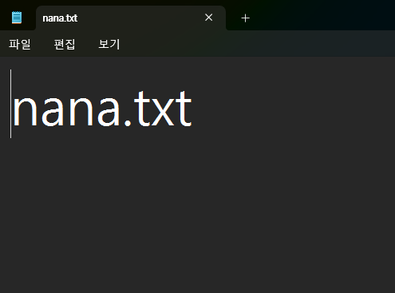
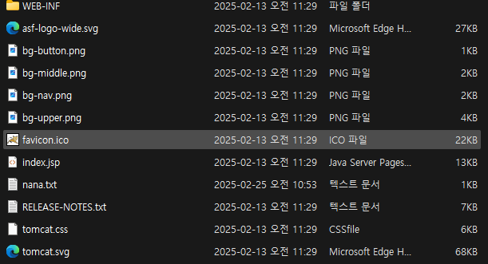    
 

4. ```localhost:8080/nana.txt```로 접속하면 홈디렉토리에 있는 ```nana.txt```문서를 웹에서 볼 수 있음.
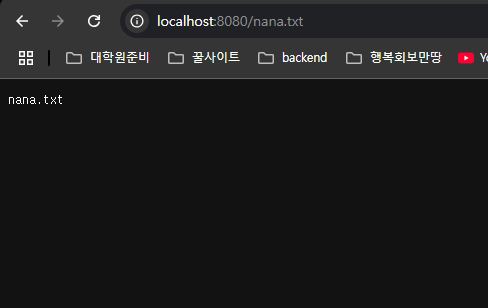

## 2. context 사이트 추가
* 위의 방법처럼 홈 디렉토리를 기준으로 여러 하위 디렉토리를 만들어 웹 애플리케이션을 관리할 수도 있지만, 그렇게 하게되면 __개발의 불편함과 너무 규모가 커지는 문제__ 등의 문제들이 발생한다.
* 그래서 웹 서버에서는 __context를 나누어 규모가 커지는 웹 애플리케이션을 효율적으로 관리__ 함.
* __Context 분리의 추가적인 장점__
  * __애플리케이션 격리__: 각 Context는 독립적으로 실행되어 서로 영향을 주지 않음. 하나의 Context에 문제가 발생해도 다른 Context는 정상적으로 작동할 수 있음.
  * __모듈화 및 관리 용이성__: 대규모 웹 애플리케이션을 기능별, 모듈별로 Context로 분리하여 개발 및 관리를 효율적으로 할 수 있음.
  * __재배포 용이성__: 특정 Context만 수정하거나 재배포해야 할 경우, 전체 서버를 재시작할 필요 없이 해당 Context만 재배포하면 됨.

## 3. Annotation을 이용한 URL 매핑
```java
@WebServlet("/hello")
```
* 서블릿 3.0으로 업데이트 되면서 위와 같은 ```어노테이션```으로 저번에 배웠던 ```web.xml```에다가 직접 매핑 정보를 적는 방법을 대체할 수 있다.

```xml
<web-app xmlns="http://xmlns.jcp.org/xml/ns/javaee"
         ...
  metadata-complete="false">
```
* 어노테이션으로 URL 매핑을 진행하려면 ```web.xml```파일의 ```metadata-complete``` 값을 ```false```로 변경해줘야 한다.
* 위의 설정을 통해 __web.xml외에 어노테이션 기반의 매핑도 사용하겠다는 의미__ 이다.

## 4. 컨텐츠 출력 형식 지정하기
### MIME 타입 명시
```java
@WebServlet("/hello")
public class Nana extends HttpServlet{
	@Override
	protected void service(HttpServletRequest req, HttpServletResponse resp) throws ServletException, IOException {
		// TODO Auto-generated method stub
		
		PrintWriter out = resp.getWriter();
		for(int i = 0; i < 100; i++) {
			out.println((i+1) + ": 안녕 Servlet!<br >");
		}
	}
}
```
* 위의 코드를 작성하여 웹 브라우저에서 열면 그 결과
    * __chrome 브라우저___
    ```
    1 : hello Servlet!<br >
    2: hello Servlet!<br >
    3: hello Servlet!<br >
    4: hello Servlet!<br >
    5: hello Servlet!<br >
    6: hello Servlet!<br >
    7: hello Servlet!<br >
    8: hello Servlet!<br >
    ...
    ```
    * __다른 브라우저__
    ```
    1: hello Servlet!
    2: hello Servlet!
    3: hello Servlet!
    4: hello Servlet!
    5: hello Servlet!
    6: hello Servlet!
    7: hello Servlet!
    8: hello Servlet!
    ...
    ```
* 위와 같은 결과가 나오는 이유는 웹서버에서 브라우저로 위 문서를 보낼 떄, __```MIME 타입```을 지정하지 않아, 브라우저마다 자의적인 해석을 하기 떄문이다__
* ```MIME 타입```은 __인터넷을 통해 전송되는 파일의 종류를 나타내는 표준 형식__ 을 뜻함. 
* 위의 문제를 해결하기 위해, servlet 파일 작성시, ```MIME 타입```을 명시해줘야 한다.

### 한글 출력하기
```java
public class Nana extends HttpServlet{
    @Override
    protected void service(HttpServletRequest req, HttpServletResponse resp) throws ServletException, IOException {
        // TODO Auto-generated method stub
        resp.setContentType("text/html");

        PrintWriter out = resp.getWriter();
        for(int i = 0; i < 100; i++) {
            out.println((i+1) + ": 안녕 Servlet!<br >");
        }
    }
}
```
* 위의 코드를 작성하여 웹 브라우저에서 열면 그 결과
```
1: ?? Servlet!
2: ?? Servlet!
3: ?? Servlet!
4: ?? Servlet!
5: ?? Servlet!
6: ?? Servlet!
7: ?? Servlet!
8: ?? Servlet!
9: ?? Servlet!
...
```
* 다음과 같은 결과를 얻을 수 있다   
 

* 위와 같은 결과가 나온 이유
1. __웹서버에서 한글을 지원하지 않는 문자코드로 인코딩한 경우__
2. __서버에서는 ```UTF-8```로 인코딩해서 보냈지만 브라우저에서 다른 코드로 잘못 해석한 경우__
* 이를 해결하기 위해 다음의 코드를 추가해주면 된다,
    ```java
    resp.setCharacterEncoding("UTF-8");
    resp.setContentType("text/html; charset=UTF-8");
    ```
* 위의 코드를 추가하면 __웹서버에서 ```UTF-8```로 인코딩해서 브라우저로 보내고, 브라우저에서 ```UTF-8```로 디코딩하게 된다.

### 한글과 MIME 타입을 지정한 올바른 코드
```java
@WebServlet("/hello")
public class Nana extends HttpServlet{
	@Override
	protected void service(HttpServletRequest req, HttpServletResponse resp) throws ServletException, IOException {
		// TODO Auto-generated method stub
		resp.setCharacterEncoding("UTF-8"); // 응답 데이터의 문자 인코딩 설정 (UTF-8)
		resp.setContentType("text/html; charset=UTF-8"); // 응답 데이터의 MIME 타입 및 문자 인코딩 설정 (HTML, UTF-8)
		
		PrintWriter out = resp.getWriter();
		for(int i = 0; i < 100; i++) {
			out.println((i+1) + ": 안녕 Servlet!<br >");
		}
	}
}
```
* 결과
```
1: 안녕 Servlet!
2: 안녕 Servlet!
3: 안녕 Servlet!
4: 안녕 Servlet!
5: 안녕 Servlet!
6: 안녕 Servlet!
7: 안녕 Servlet!
8: 안녕 Servlet!
9: 안녕 Servlet!
...
```

## 5. 사용자 요청 받기
### __GET 요청__
* 사용자가 구체적으로 무엇을 달라는 요청을 할 수 있음.
  * https://localhost/hi -> ```get 요청```
  * https://localhost/hi __?cnt=3__ -> ```get 요청```
* 위의 요청에서 ```?cnt=3``` 부분을 ```QueryString```이라고 한다.
* __```QueryString```을 통해 클라이언트는 서버에 사전에 협의된 형식으로 원하는 특정 데이터를 요청할 수 있음.__
```java
int cnt = Integer.parseInt(req.getParameter("cnt"));
		
for(int i = 0; i < cnt; i++) {
    out.println((i+1) + ": 안녕 Servlet!<br >");
}
```
* ```req.getParameter("cnt")``` 다음의 코드로 ```QueryString```에서 cnt 값을 받을 수 있고,
* 이를 정수로 바꾸어 cnt 개수만큼 출력할 수 있다.  

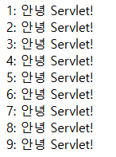

### __QueryString 기본값 설정__
* 만약 클라이언트가 QueryString을 빼먹는 실수를 하면 어떻게 될까?  
 

* 요청
```
URL : https://localhost/hi
```
* 결과  

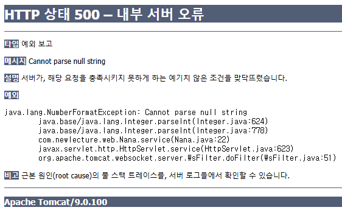

* 그래서 위의 경우를 미리 생각하여 __기본값을 설정__ 할 수 있다.
  * https://localhost/hi?cnt=3 -> ```cnt = "3"```
  * https://localhost/hi?cnt=  -> ```cnt = ""``` -> __기본값 설정 필요__
  * https://localhost/hi?      -> ```NULL``` -> __기본값 설정 필요__
  * https://localhost/hi -> ```NULL``` -> __기본값 설정 필요__
```java
String cnt_ = req.getParameter("cnt");
int cnt = 100;
if(cnt_ != null && cnt_.equals("")) {
    cnt = Integer.parseInt(cnt_);
}
```
* 위의 코드로 QueryString이 제대로 들어오지 않았을 경우 기본값 100이 설정되도록 함.

### __사용자 입력을 통한 GET 요청__
```html
<body>
<div>
  <form action = "hi">  -> URL 작성 ( http://.../hi )
    <div>
      <label>"안녕하세요를 몇 번 듣고 싶으세요?</label>
    </div>
    <div>
      <input type="text" name = "cnt"/>  -> QueryString 생성 ( http://.../hi?cnt=3 ) 
      <input type="submit" value = "출력" />
    </div>
  </form>
</div>
</body>
```
* ```hello.html``` 페이지를 만들어 cnt 값을 입력받음
  * form의 ```action 태그```를 사용해 기본적인 URL을 생성
  ```html
  <form action = "hi">  -> URL 작성 ( http://.../hi )
  ```
  * input의 ```name 태그```에 QueryString의 키 값을 설정하고, 사용자에게 대응하는 값을 입력 받음.
  ```html
  <input type="text" name = "cnt"/>  -> QueryString 생성 ( http://.../hi?cnt=3 )
  ```
* 결론적으로 입력받은 cnt 값을 바탕으로 위에서 미리 작성한 servlet을 사용해 클라이언트에게 출력.

### __POST 요청__
* GET으로 요청을 받을 경우 일반적으로 URL에 요청정보가 담기기 때문에 __URL 길이 제한과 보안 문제__ 가 발생할 수 있다.
* 이 경우 __POST__ 로 입력 받을 수 있다.    
* __POST__ 방식은 GET 방식보다 더 많은 정보를 받을 수 있고, 보안성도 더 좋다.   


* POST 요청의 일반적인 요청 방식 예시
```
    클라이언트                         웹서버
햄버거 주문서 주세요 ---GET 요청--> 
햄버거 상세 주분 내역 ---POST 요청-->   요청 처리
                   <----햄버거---
```

* 그에 대응하는 servlet 코드
```java
@WebServlet("/notice-reg")
public class NoticeReg extends HttpServlet{
	@Override
	protected void service(HttpServletRequest req, HttpServletResponse resp) throws ServletException, IOException {
		// TODO Auto-generated method stub
		resp.setCharacterEncoding("UTF-8");
		resp.setContentType("text/html; charset=UTF-8");
		
		PrintWriter out = resp.getWriter();
		
		String titleString = req.getParameter("title");
		String contentString = req.getParameter("content");
		
		out.println(titleString);
		out.println(contentString);
	}
}
```
### 한글 입력 문제
* 위의 코드대로 브라우저에서 한글을 입력 받아 그대로 출력하면
```
hello 안녕하세요
```
* 다음과 같이 한글 깨짐 문제가 발생.
* 더 자세하게 __멀티 바이트 문자(한글) 전송 문제__ 가 발생.
    
 
* 이를 해결하기 위해 __웹서버 측에서도 요청받은 값을 UTF-8 인코딩 방식으로 변환하도록 처리__ 해줘야 한다.
* 크게 두가지 방법이 있는데, __1. 웹서버 자체의 설정 변경__ __2. servlet 파일에서 따로 인코딩 방식 처리__    
 

* 2번째 방법으로 해결
```java
request.setCharacterEncoding("UTF-8");
```

### 서블릿 필터(Servlet filter)
* ```서블릿 필터```는 웹 애플리케이션에서 클라이언트 요청과 서버의 응답을 가로채서 처리할 수 있는 재사용 가능한 컴포넌트.
* 서블릿 컨테이너에 의해 관리되며, __서블릿이나 자원에 접근하기 전후에 특정 작업을 수행 가능.__    


* 위의 특성을 통해 __한글 입력 문제__ 를 해결하기 위해 모든 서블릿 코드에 코드를 삽입하는 것이 아닌 __필터를 사용해 모든 서블릿 코드에서 UTF-8 방식으로 인코딩 변환하도록 처리할 수 있음.__
```java
public class CharacterEncodingFilter implements Filter {

	@Override
	public void doFilter(ServletRequest request, ServletResponse response, FilterChain chain)
			throws IOException, ServletException {
		request.setCharacterEncoding("UTF-8"); // 서블릿 실행 이전에 요청의 인코딩 방식을 UTF-8로 설정
        
		chain.doFilter(request, response); // 기준으로 이전엔 서블릿 실행 이전에 처리 혹은 이후에 처리로 나뉨
        
	}

}
```
    
 
* 해당 필터를 적용하기 위해 __1. web.xml에 명시 2.annotation 사용__
1. web.xml에 명시
    ```xml
   <web-app ...
     
    <filter>
    <filter-name>CharacterEncodingFilter</filter-name>
    <filter-class>com.newlecture.web.filter.CharacterEncodingFilter</filter-class>
    </filter>
    <filter-mapping>
    <filter-name>CharacterEncodingFilter</filter-name>
    <url-pattern>/*</url-pattern>
    </filter-mapping>
     
     ...
    </web-app>
    ```

2. 서블릿 코드에 어노테이션으로 설정 (요즘 선호되는 방식)
    ```java 
   @WebFilter("/*")
    ```
   
* __위와 같이 서블릿 코드를 작성하고, 필터를 적용하면 모든 url 요청에 대해서 인코딩 방식을 UTF-8로 적용 가능.__

## 6. 과제 (입력한 결과 계산하여 출력하기)
### 사용자 입력을 통한 계산 요청
```
      클라이언트                             웹서버
계산 입력을 위한 폼을 주세요 -----GET---->  
                           <---HTML----  
입력                       -----POST--->  add문서 생성
                          <-------------
```

* __HTML코드__
```html
<!DOCTYPE html>
<html>
<head>
<meta charset="UTF-8">
<title>Insert title here</title>
</head>
<body>
	<div>
		<form action="add" method = "post">
			<div><label>계산할 값을 입력하세요</label></div>
			<div><input type="text" name="x"><input type="text" name="y"></div>
			<div><input type="submit" value="sum" name="sum"></div>
		</form>
	</div>
</body>
</html>
```

* __servlet 코드__
```java
...

@WebServlet("/add")
public class Add extends HttpServlet {
	@Override
	protected void service(HttpServletRequest req, HttpServletResponse resp) throws ServletException, IOException{
		resp.setCharacterEncoding("UTF-8");
		resp.setContentType("text/html; charset=UTF-8");
		
		PrintWriter out = resp.getWriter();
		
        // 사용자에게 받은 값들
		String x_String = req.getParameter("x"); // input의 name 속성과 동일한 input의 값.
		String y_String = req.getParameter("y");
		
        // 사용자에게 받은 값들이 숫자인지 판별
		if(x_String.matches("[+-]?\\d*(\\.\\d+)?") && y_String.matches("[+-]?\\d*(\\.\\d+)?")) {
			int x = Integer.parseInt(x_String);
			int y = Integer.parseInt(y_String);
			
			out.println("계산 결과 : " + (x+y));
		}
        // 숫자가 아닌 경우 입력 오류 출력
		else {
			out.println("입력 오류");
		}
	}
}
```
* 입력 폼

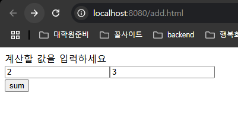

* 결과

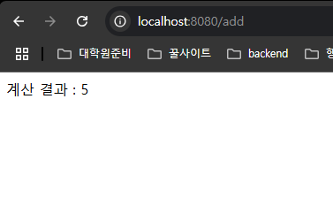

### 여러가지 submit버튼 사용하기
* 사용자에게 동일하게 두 값을 입력받지만, 합 or 차 버튼 선택하기
* __HTML 코드__
```html
...
<div><input type="submit" value="sum" name="button"></div>
<div><input type="submit" value="sub" name="button"></div>
...
```
* __servlet 코드__
```java
...
String operator = req.getParameter("button"); // input name="button"(두 버튼)에서의 value 값을 받음

if(x_String.matches("[+-]?\\d*(\\.\\d+)?") && y_String.matches("[+-]?\\d*(\\.\\d+)?")) {
    int x = Integer.parseInt(x_String);
    int y = Integer.parseInt(y_String);
    
    // operator 값에 따라 합 또는 차를 출력
    if(operator.equals("sum")) out.println("계산 결과 : " + (x+y));
    else if(operator.equals("sub")) out.println("뺄셈 결과 : " + (x-y));
    ...                            

```
* 버튼이 두 개 이상일 경우 __name 속성의 값은 같게 하고, value 값을 다르게 하여 값을 구별__   


* 입력 폼  
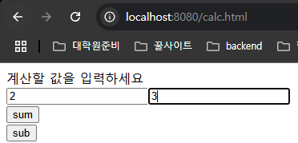

* 결과  
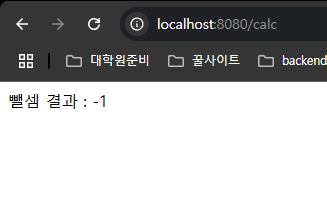

### 입력 데이터 배열로 받기
* 사용자에게 받아야하는 값 중에 입력 받을 개수를 모르는 경우(자격증, 가족관계 ...)가 많다.
* 이럴 땐, 모든 name 속성의 값을 다르게 하는 것이 아니라, 같게 하여 배열로 받을 수 있다.
* __HTML 코드__
```html
...
<div>
  <input type="text" name="num">
  <input type="text" name="num">
  <input type="text" name="num">
  <input type="text" name="num">
</div>
...
```
* __servlet 코드__
```java
...
String[] num_Strings = req.getParameterValues("num"); // getParameterValues 매서드로 name="num"인 input들의 값을 배열로 받음.
		
int result = 0;
boolean flag = false;
for(int i = 0; i < num_Strings.length; i++) {
    // 각각의 값이 숫자인지 판별하고 아닌 경우 반복 중단
    if(!(num_Strings[i].matches("[+-]?\\d*(\\.\\d+)?"))) {
        flag = true;
        break;
    }
    
    int num = Integer.parseInt(num_Strings[i]);
    result += num;
    // flag 값이 true인 경우(숫자 아닌게 하나라고 있는 경우) 입력 오류 출력, 아닌 경우 결과 출력 
    if(flag) { out.println("입력 오류"); }
        else { out.println("계산 결과 : " + result);}
}
        ...
```
* html에서 __input의 name 속성 값을 동일하게 하면, servlet에서 ```getParameterValues 매서드```를 이용해 값들을 배열로 받을 수 있음.__
    

* 입력 폼
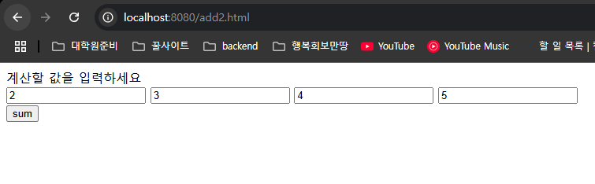

* 결과  
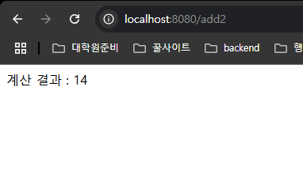

## 7. 상태 유지가 필요한 경우에서의 구현
### 사용자로부터 두 개의 값을 개별적으로 받는 방식
* __예시__
```
     클라이언트
                ----post---> calc?x=
                ----post---> calc?x=15
                ----post---> calc?x=2
                
                <---------- 결과 문서 생성
```
* 위와 같은 작업을 위해선 사용자로부터 받은 __값(상태)를 유지__ 할 수 있어야 함.

### 상태 유지를 위한 5가지 방법
1. __servlet Context(application)__
2. __session__
3. __cookie__
4. (hidden)
5. (queryString)

### 1. servlet Context(application 객체)를 사용한 상태 값 저장
#### __ServletContext란?__
* ```servletContext```는 웹 서버가 웹 애플리케이션을 실행할 때, 생성하는 객체로, __웹 애플리케이션 전체를 대표__
* 웹 애플리케이션 내의 모든 서블릿, 필터, 리스너 등이 공유하여 사용할 수 있는 유일한 객체.

### __ServletContext를 이용한 상태값 저장 예시__
* __html 코드__
```html
<!DOCTYPE html>
<html>
<head>
<meta charset="UTF-8">
<title>Insert title here</title>
</head>
<body>
	<div>
		<form action="calc2" method = "post">
			<div><label>계산할 값을 입력하세요</label></div>
			<div><input type="text" name="v"></div>
			<div>
				<input type="submit" value="+" name="operator">
				<input type="submit" value="-" name="operator">
				<input type="submit" value="=" name="operator">
			</div>
		</form>
	</div>
</body>
</html>
```
* servlet 코드
```java
@WebServlet("/calc2")
public class Calc2 extends HttpServlet {
	@Override
	protected void service(HttpServletRequest req, HttpServletResponse resp) throws ServletException, IOException{
		ServletContext application = req.getServletContext(); //servlet context 객체를 얻음.
      
		resp.setCharacterEncoding("UTF-8");
		resp.setContentType("text/html; charset=UTF-8");
		
		PrintWriter out = resp.getWriter();
			
		String v_String = req.getParameter("v");
		String operator = req.getParameter("operator");
		
		int v = 0;
		if(!v_String.equals("")) v = Integer.parseInt(v_String);
		
		int result = 0;
		
        // 사용자가 "=" 을 클릭한 경우(계산을 마무리하고 싶은 경우)
		if(operator.equals("=")) {
			int x = (Integer)application.getAttribute("value"); // 이전에 입력했던 ServletContext에 저장된 값("value"에 대응되는)을 가져옴.
			int y = v;
			
            // 이전에 입력했던 ServletContext에 저장된 값("operator"에 대응되는)이 뭔지에 따라 달리 계산
			if(application.getAttribute("operator").equals("+")) {
				result = x+y;
			} else {
				result = x-y;
			}
			
			out.println("계산 결과 : " + result);
		}
		
		else {
            // 현재 입력된 값(value)과 연산자(operator)를 ServletContext에 저장하여 다음 계산에 사용될 수 있도록 함.
			application.setAttribute("value", v);
			application.setAttribute("operator", operator);
		}
		
	}
}
```
* __입력 폼__  
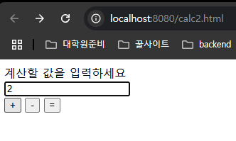
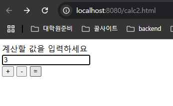

* __결과__   
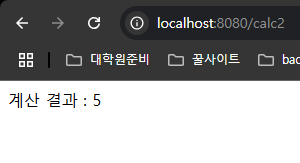

### 2. session을 이용한 상태 값 저장
#### session이란?
* ```session 객체```는 특정 웹 브라우저(사용자)와 웹 서버 간의 __상태를 유지__ 하기 위해 사용되는 객체.
* ```session 객체```는 HTTP의 stateless한 환경에서 사용자를 식별하고, 사용자의 활동에 대한 정보를 저장하고 관리.

#### __session 객체를 이용한 상태값 저장 예시__
* html은 위와 동일   
 

* __servlet 코드__
```java
@WebServlet("/calc2")
public class Calc2 extends HttpServlet {
	@Override
	protected void service(HttpServletRequest req, HttpServletResponse resp) throws ServletException, IOException{
		HttpSession session = req.getSession(); // session 객체 가져오기.
		resp.setCharacterEncoding("UTF-8");
		resp.setContentType("text/html; charset=UTF-8");
		
		PrintWriter out = resp.getWriter();
			
		String v_String = req.getParameter("v");
		String operator = req.getParameter("operator");
		
		int v = 0;
		if(!v_String.equals("")) v = Integer.parseInt(v_String);
		
		int result = 0;
		
		if(operator.equals("=")) {
			int x = (Integer)session.getAttribute("value"); // 이전에 입력했던 session에 저장된 값("value"에 대응되는)을 가져옴.
			int y = v;

          // 이전에 입력했던 session에 저장된 값("operator"에 대응되는)이 뭔지에 따라 달리 계산
			if(session.getAttribute("operator").equals("+")) {
				result = x+y;
			} else {
				result = x-y;
			}
			
			out.println("계산 결과 : " + result);
		}
		
		else {
          // 현재 입력된 값(value)과 연산자(operator)를 session에 저장하여 다음 계산에 사용될 수 있도록 함.
			session.setAttribute("value", v);
			session.setAttribute("operator", operator);
		}
		
	}
}
```
  
* 같은 브라우저에서 연속적으로 입력했을 경우 입력폼과 결과는 Context때와 동일   

#### 각기 다른 브라우저에서 입력
* __입력 폼__   

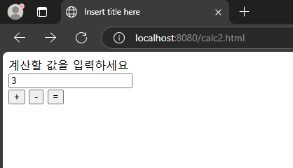

* __결과__
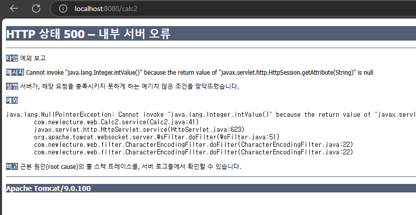   
 

* 세션은 브라우저마다 존재하기에 __각기 다른 브라우저에서 입력하면 상태값이 저장되지 않음을 확인할 수 있음.__

#### ServletContext와 session의 차이점
1. __범위(scope)__
  * __Servlet Context__ : __웹 애플리케이션 전체__ 에 걸쳐 공유되는 객체. 웹 애플리케이션 내의 모든 서블릿,필터,리스너에서 접근 및 공유 가능.
  * __HttpSession__ : __특정 사용자 (웹 브라우저)를 위한 객체__입니다. 각 사용자마다 고유한 HttpSession이 생성

2. __생명 주기__
   * __Servlet Context__ : 웹 애플리케이션의 __시작과 종료__를 함께 함.
   * __HttpSession__ : 사용자가 웹 애플리케이션에 __처음 접근하거나 명시적으로 세션을 생성__ 할 때 생성될 수 있음.
    

3. __주요 용도 (Primary Use Cases)__
   * __ServletContext__ :
     * 애플리케이션 전역 설정: 데이터베이스 연결 정보, 환경 설정 파일 경로 등 애플리케이션 전체에서 공유해야 하는 설정 정보를 저장합니다.
     * 애플리케이션 통계: 전체 사용자 수, 방문자 수 등 애플리케이션 전체에 대한 통계를 저장합니다.
   * __HttpSession__ :
     * 사용자 인증 정보: 로그인한 사용자의 ID, 권한 등 인증 정보를 저장하여 사용자의 로그인 상태를 유지합니다.
     * 개인화된 사용자 정보: 사용자의 선호도, 설정 등을 저장하여 개인화된 서비스를 제공합니다.
     * 장바구니 정보: 사용자가 선택한 상품 목록을 저장하여 쇼핑 과정을 관리합니다.
   
 
4. __비유__
  * __ServletContext__ : 웹 애플리케이션이라는 __"건물"__ 자체에 비유할 수 있음. 건물에는 모든 사람이 공유하는 로비, 엘리베이터, 공지사항 게시판 등이 있음. 이는 웹 애플리케이션이 공유하는 정보나 자원이 해당.
  * __HttpSession__웹 애플리케이션을 이용하는 __"개별 방문객"__ 에게 제공되는 개인적인 __"방"__ 에 비유할 수 있음. 각 방문객은 자신의 방에 개인적인 물건이나 정보를 보관할 수 있음.


