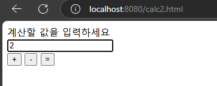
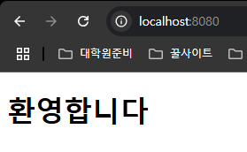
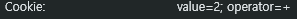
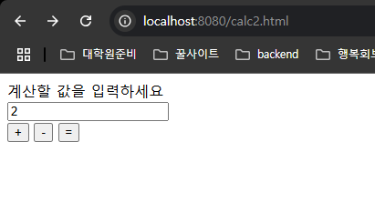
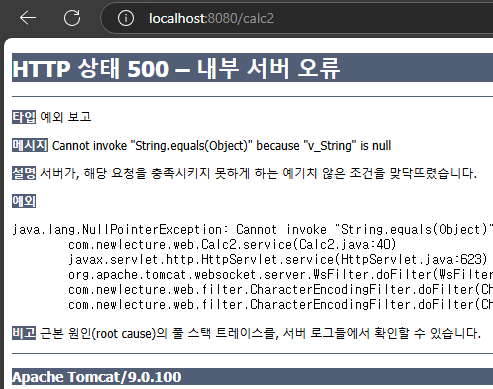
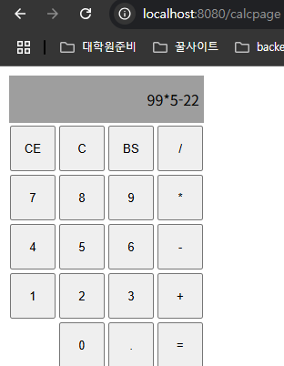
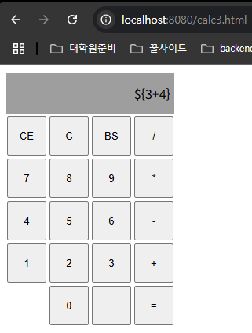
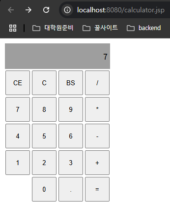
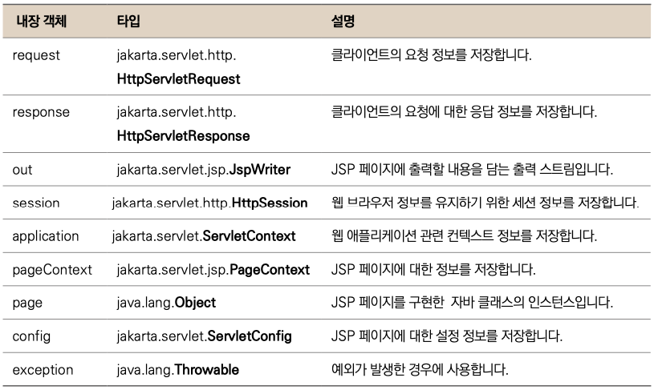

# Servlet and JSP
## day 1 - 웹 서버 프로그래밍
### 1. 정적 웹 페이지와 그 한계
* 초창기 웹이 출현했을 때는 정적(static)인 웹 페이지 만으로 충분했다
* 하지만 __정적 웹 페이지는 내용이 이미 정해져 있기 때문에, 각각 사용자의 요구를 맞출 수가 없음.__

### 2. 웹 서버와 WAS
* ```웹 서버```는 클라이언트의 요청을 받아 __정적인 요소__ (HTML,CSS,JavaScript 파일, 이미지 등)을 제공하는 역할.
* ```WAS```는 웹 서버의 기능을 포함하면서 __동적인 요소__ (데이터베이스 연동 등)를 처리하여 클라이언트에게 제공하는 역할.
* ```웹 서버와 WAS의 관계``` : 일반적으로 웹 서버는 정적인 컨텐츠를 처리, WAS는 동적인 컨텐츠를 처리하도록 구성하여 효율적인 서비스 제공. 웹 서버는 클라이언트의 요청을 받아 정적인 컨텐츠는 즉시 처리, 동적인 컨텐츠 요청은 WAS에게 넘겨 처리하도록 함.

### 3. server APP
* 사용자가 요청한 여러 기능들을 수행 -> 이는 보통 WAS 위에서 실행.

### 4. 웹 기반의 클라이언트/서버 프로그램 예시 과정
1. 클라이언트 (웹 브라우저): 사용자가 웹 브라우저를 통해 웹 사이트에 접속하여 멤버 리스트를 요청합니다.

2. 웹 서버 (Web Server):
* 클라이언트의 요청을 받습니다.
* 정적인 콘텐츠 (HTML, CSS, JavaScript 파일 등)가 있다면 즉시 클라이언트에게 제공합니다.
* 멤버 리스트와 같은 동적인 콘텐츠 요청은 WAS에게 전달합니다. 

3. WAS (Web Application Server):
* 웹 서버로부터 동적인 콘텐츠 요청 (멤버 리스트 요청)을 받습니다.
* 해당 요청을 처리할 서버 앱을 선택합니다.
* 서버 앱을 실행하여 요청을 처리합니다.

4. 서버 앱 (Server Application):
* WAS 환경에서 실행되며, 멤버 리스트를 가져오는 기능을 수행합니다.
* 데이터베이스 또는 다른 저장소에서 멤버 정보를 조회합니다.
* 조회된 멤버 정보를 WAS에게 반환합니다.

6. WAS:
* 서버 앱으로부터 받은 멤버 정보를 클라이언트에게 전달할 수 있는 형태로 가공합니다 (예: JSON, XML 형식).
* 가공된 데이터를 웹 서버에게 전달합니다.

7. 웹 서버:
* WAS로부터 받은 데이터를 클라이언트에게 응답합니다.
* 클라이언트 (웹 브라우저):

* 웹 서버로부터 받은 멤버 리스트 데이터를 화면에 표시합니다.

## 2. 웹 문서 추가해보기
### 1. 테스트 문서 만들고 서비스하기 
1. 먼저 __웹서버__ 와 __WAS__ 기능을 동시에 가지는 __tomcat__ 을 설치.
2. __startup.bat__ 을 실행하여 웹서버 시작.
3. __홈 디렉토리__ (웹사이트의 시작점이자 웹 서버의 기준 폴더)에 문서(nana.txt) 추가.

    
 

4. ```localhost:8080/nana.txt```로 접속하면 홈디렉토리에 있는 ```nana.txt```문서를 웹에서 볼 수 있음.


## 2. context 사이트 추가
* 위의 방법처럼 홈 디렉토리를 기준으로 여러 하위 디렉토리를 만들어 웹 애플리케이션을 관리할 수도 있지만, 그렇게 하게되면 __개발의 불편함과 너무 규모가 커지는 문제__ 등의 문제들이 발생한다.
* 그래서 웹 서버에서는 __context를 나누어 규모가 커지는 웹 애플리케이션을 효율적으로 관리__ 함.
* __Context 분리의 추가적인 장점__
  * __애플리케이션 격리__: 각 Context는 독립적으로 실행되어 서로 영향을 주지 않음. 하나의 Context에 문제가 발생해도 다른 Context는 정상적으로 작동할 수 있음.
  * __모듈화 및 관리 용이성__: 대규모 웹 애플리케이션을 기능별, 모듈별로 Context로 분리하여 개발 및 관리를 효율적으로 할 수 있음.
  * __재배포 용이성__: 특정 Context만 수정하거나 재배포해야 할 경우, 전체 서버를 재시작할 필요 없이 해당 Context만 재배포하면 됨.

## 3. Annotation을 이용한 URL 매핑
```java
@WebServlet("/hello")
```
* 서블릿 3.0으로 업데이트 되면서 위와 같은 ```어노테이션```으로 저번에 배웠던 ```web.xml```에다가 직접 매핑 정보를 적는 방법을 대체할 수 있다.

```xml
<web-app xmlns="http://xmlns.jcp.org/xml/ns/javaee"
         ...
  metadata-complete="false">
```
* 어노테이션으로 URL 매핑을 진행하려면 ```web.xml```파일의 ```metadata-complete``` 값을 ```false```로 변경해줘야 한다.
* 위의 설정을 통해 __web.xml외에 어노테이션 기반의 매핑도 사용하겠다는 의미__ 이다.

## 4. 컨텐츠 출력 형식 지정하기
### MIME 타입 명시
```java
@WebServlet("/hello")
public class Nana extends HttpServlet{
	@Override
	protected void service(HttpServletRequest req, HttpServletResponse resp) throws ServletException, IOException {
		// TODO Auto-generated method stub
		
		PrintWriter out = resp.getWriter();
		for(int i = 0; i < 100; i++) {
			out.println((i+1) + ": 안녕 Servlet!<br >");
		}
	}
}
```
* 위의 코드를 작성하여 웹 브라우저에서 열면 그 결과
    * __chrome 브라우저___
    ```
    1 : hello Servlet!<br >
    2: hello Servlet!<br >
    3: hello Servlet!<br >
    4: hello Servlet!<br >
    5: hello Servlet!<br >
    6: hello Servlet!<br >
    7: hello Servlet!<br >
    8: hello Servlet!<br >
    ...
    ```
    * __다른 브라우저__
    ```
    1: hello Servlet!
    2: hello Servlet!
    3: hello Servlet!
    4: hello Servlet!
    5: hello Servlet!
    6: hello Servlet!
    7: hello Servlet!
    8: hello Servlet!
    ...
    ```
* 위와 같은 결과가 나오는 이유는 웹서버에서 브라우저로 위 문서를 보낼 떄, __```MIME 타입```을 지정하지 않아, 브라우저마다 자의적인 해석을 하기 떄문이다__
* ```MIME 타입```은 __인터넷을 통해 전송되는 파일의 종류를 나타내는 표준 형식__ 을 뜻함. 
* 위의 문제를 해결하기 위해, servlet 파일 작성시, ```MIME 타입```을 명시해줘야 한다.

### 한글 출력하기
```java
public class Nana extends HttpServlet{
    @Override
    protected void service(HttpServletRequest req, HttpServletResponse resp) throws ServletException, IOException {
        // TODO Auto-generated method stub
        resp.setContentType("text/html");

        PrintWriter out = resp.getWriter();
        for(int i = 0; i < 100; i++) {
            out.println((i+1) + ": 안녕 Servlet!<br >");
        }
    }
}
```
* 위의 코드를 작성하여 웹 브라우저에서 열면 그 결과
```
1: ?? Servlet!
2: ?? Servlet!
3: ?? Servlet!
4: ?? Servlet!
5: ?? Servlet!
6: ?? Servlet!
7: ?? Servlet!
8: ?? Servlet!
9: ?? Servlet!
...
```
* 다음과 같은 결과를 얻을 수 있다   
 

* 위와 같은 결과가 나온 이유
1. __웹서버에서 한글을 지원하지 않는 문자코드로 인코딩한 경우__
2. __서버에서는 ```UTF-8```로 인코딩해서 보냈지만 브라우저에서 다른 코드로 잘못 해석한 경우__
* 이를 해결하기 위해 다음의 코드를 추가해주면 된다,
    ```java
    resp.setCharacterEncoding("UTF-8");
    resp.setContentType("text/html; charset=UTF-8");
    ```
* 위의 코드를 추가하면 __웹서버에서 ```UTF-8```로 인코딩해서 브라우저로 보내고, 브라우저에서 ```UTF-8```로 디코딩하게 된다.

### 한글과 MIME 타입을 지정한 올바른 코드
```java
@WebServlet("/hello")
public class Nana extends HttpServlet{
	@Override
	protected void service(HttpServletRequest req, HttpServletResponse resp) throws ServletException, IOException {
		// TODO Auto-generated method stub
		resp.setCharacterEncoding("UTF-8"); // 응답 데이터의 문자 인코딩 설정 (UTF-8)
		resp.setContentType("text/html; charset=UTF-8"); // 응답 데이터의 MIME 타입 및 문자 인코딩 설정 (HTML, UTF-8)
		
		PrintWriter out = resp.getWriter();
		for(int i = 0; i < 100; i++) {
			out.println((i+1) + ": 안녕 Servlet!<br >");
		}
	}
}
```
* 결과
```
1: 안녕 Servlet!
2: 안녕 Servlet!
3: 안녕 Servlet!
4: 안녕 Servlet!
5: 안녕 Servlet!
6: 안녕 Servlet!
7: 안녕 Servlet!
8: 안녕 Servlet!
9: 안녕 Servlet!
...
```

## 5. 사용자 요청 받기
### __GET 요청__
* 사용자가 구체적으로 무엇을 달라는 요청을 할 수 있음.
  * https://localhost/hi -> ```get 요청```
  * https://localhost/hi __?cnt=3__ -> ```get 요청```
* 위의 요청에서 ```?cnt=3``` 부분을 ```QueryString```이라고 한다.
* __```QueryString```을 통해 클라이언트는 서버에 사전에 협의된 형식으로 원하는 특정 데이터를 요청할 수 있음.__
```java
int cnt = Integer.parseInt(req.getParameter("cnt"));
		
for(int i = 0; i < cnt; i++) {
    out.println((i+1) + ": 안녕 Servlet!<br >");
}
```
* ```req.getParameter("cnt")``` 다음의 코드로 ```QueryString```에서 cnt 값을 받을 수 있고,
* 이를 정수로 바꾸어 cnt 개수만큼 출력할 수 있다.  


### __QueryString 기본값 설정__
* 만약 클라이언트가 QueryString을 빼먹는 실수를 하면 어떻게 될까?  
 

* 요청
```
URL : https://localhost/hi
```
* 결과  


* 그래서 위의 경우를 미리 생각하여 __기본값을 설정__ 할 수 있다.
  * https://localhost/hi?cnt=3 -> ```cnt = "3"```
  * https://localhost/hi?cnt=  -> ```cnt = ""``` -> __기본값 설정 필요__
  * https://localhost/hi?      -> ```NULL``` -> __기본값 설정 필요__
  * https://localhost/hi -> ```NULL``` -> __기본값 설정 필요__
```java
String cnt_ = req.getParameter("cnt");
int cnt = 100;
if(cnt_ != null && cnt_.equals("")) {
    cnt = Integer.parseInt(cnt_);
}
```
* 위의 코드로 QueryString이 제대로 들어오지 않았을 경우 기본값 100이 설정되도록 함.

### __사용자 입력을 통한 GET 요청__
```html
<body>
<div>
  <form action = "hi">  -> URL 작성 ( http://.../hi )
    <div>
      <label>"안녕하세요를 몇 번 듣고 싶으세요?</label>
    </div>
    <div>
      <input type="text" name = "cnt"/>  -> QueryString 생성 ( http://.../hi?cnt=3 ) 
      <input type="submit" value = "출력" />
    </div>
  </form>
</div>
</body>
```
* ```hello.html``` 페이지를 만들어 cnt 값을 입력받음
  * form의 ```action 태그```를 사용해 기본적인 URL을 생성
  ```html
  <form action = "hi">  -> URL 작성 ( http://.../hi )
  ```
  * input의 ```name 태그```에 QueryString의 키 값을 설정하고, 사용자에게 대응하는 값을 입력 받음.
  ```html
  <input type="text" name = "cnt"/>  -> QueryString 생성 ( http://.../hi?cnt=3 )
  ```
* 결론적으로 입력받은 cnt 값을 바탕으로 위에서 미리 작성한 servlet을 사용해 클라이언트에게 출력.

### __POST 요청__
* GET으로 요청을 받을 경우 일반적으로 URL에 요청정보가 담기기 때문에 __URL 길이 제한과 보안 문제__ 가 발생할 수 있다.
* 이 경우 __POST__ 로 입력 받을 수 있다.    
* __POST__ 방식은 GET 방식보다 더 많은 정보를 받을 수 있고, 보안성도 더 좋다.   


* POST 요청의 일반적인 요청 방식 예시
```
    클라이언트                         웹서버
햄버거 주문서 주세요 ---GET 요청--> 
햄버거 상세 주분 내역 ---POST 요청-->   요청 처리
                   <----햄버거---
```

* 그에 대응하는 servlet 코드
```java
@WebServlet("/notice-reg")
public class NoticeReg extends HttpServlet{
	@Override
	protected void service(HttpServletRequest req, HttpServletResponse resp) throws ServletException, IOException {
		// TODO Auto-generated method stub
		resp.setCharacterEncoding("UTF-8");
		resp.setContentType("text/html; charset=UTF-8");
		
		PrintWriter out = resp.getWriter();
		
		String titleString = req.getParameter("title");
		String contentString = req.getParameter("content");
		
		out.println(titleString);
		out.println(contentString);
	}
}
```
### 한글 입력 문제
* 위의 코드대로 브라우저에서 한글을 입력 받아 그대로 출력하면
```
hello 안녕하세요
```
* 다음과 같이 한글 깨짐 문제가 발생.
* 더 자세하게 __멀티 바이트 문자(한글) 전송 문제__ 가 발생.
    
 
* 이를 해결하기 위해 __웹서버 측에서도 요청받은 값을 UTF-8 인코딩 방식으로 변환하도록 처리__ 해줘야 한다.
* 크게 두가지 방법이 있는데, __1. 웹서버 자체의 설정 변경__ __2. servlet 파일에서 따로 인코딩 방식 처리__    
 

* 2번째 방법으로 해결
```java
request.setCharacterEncoding("UTF-8");
```

### 서블릿 필터(Servlet filter)
* ```서블릿 필터```는 웹 애플리케이션에서 클라이언트 요청과 서버의 응답을 가로채서 처리할 수 있는 재사용 가능한 컴포넌트.
* 서블릿 컨테이너에 의해 관리되며, __서블릿이나 자원에 접근하기 전후에 특정 작업을 수행 가능.__    


* 위의 특성을 통해 __한글 입력 문제__ 를 해결하기 위해 모든 서블릿 코드에 코드를 삽입하는 것이 아닌 __필터를 사용해 모든 서블릿 코드에서 UTF-8 방식으로 인코딩 변환하도록 처리할 수 있음.__
```java
public class CharacterEncodingFilter implements Filter {

	@Override
	public void doFilter(ServletRequest request, ServletResponse response, FilterChain chain)
			throws IOException, ServletException {
		request.setCharacterEncoding("UTF-8"); // 서블릿 실행 이전에 요청의 인코딩 방식을 UTF-8로 설정
        
		chain.doFilter(request, response); // 기준으로 이전엔 서블릿 실행 이전에 처리 혹은 이후에 처리로 나뉨
        
	}

}
```
    
 
* 해당 필터를 적용하기 위해 __1. web.xml에 명시 2.annotation 사용__
1. web.xml에 명시
    ```xml
   <web-app ...
     
    <filter>
    <filter-name>CharacterEncodingFilter</filter-name>
    <filter-class>com.newlecture.web.filter.CharacterEncodingFilter</filter-class>
    </filter>
    <filter-mapping>
    <filter-name>CharacterEncodingFilter</filter-name>
    <url-pattern>/*</url-pattern>
    </filter-mapping>
     
     ...
    </web-app>
    ```

2. 서블릿 코드에 어노테이션으로 설정 (요즘 선호되는 방식)
    ```java 
   @WebFilter("/*")
    ```
   
* __위와 같이 서블릿 코드를 작성하고, 필터를 적용하면 모든 url 요청에 대해서 인코딩 방식을 UTF-8로 적용 가능.__

## 6. 과제 (입력한 결과 계산하여 출력하기)
### 사용자 입력을 통한 계산 요청
```
      클라이언트                             웹서버
계산 입력을 위한 폼을 주세요 -----GET---->  
                           <---HTML----  
입력                       -----POST--->  add문서 생성
                          <-------------
```

* __HTML코드__
```html
<!DOCTYPE html>
<html>
<head>
<meta charset="UTF-8">
<title>Insert title here</title>
</head>
<body>
	<div>
		<form action="add" method = "post">
			<div><label>계산할 값을 입력하세요</label></div>
			<div><input type="text" name="x"><input type="text" name="y"></div>
			<div><input type="submit" value="sum" name="sum"></div>
		</form>
	</div>
</body>
</html>
```

* __servlet 코드__
```java
...

@WebServlet("/add")
public class Add extends HttpServlet {
	@Override
	protected void service(HttpServletRequest req, HttpServletResponse resp) throws ServletException, IOException{
		resp.setCharacterEncoding("UTF-8");
		resp.setContentType("text/html; charset=UTF-8");
		
		PrintWriter out = resp.getWriter();
		
        // 사용자에게 받은 값들
		String x_String = req.getParameter("x"); // input의 name 속성과 동일한 input의 값.
		String y_String = req.getParameter("y");
		
        // 사용자에게 받은 값들이 숫자인지 판별
		if(x_String.matches("[+-]?\\d*(\\.\\d+)?") && y_String.matches("[+-]?\\d*(\\.\\d+)?")) {
			int x = Integer.parseInt(x_String);
			int y = Integer.parseInt(y_String);
			
			out.println("계산 결과 : " + (x+y));
		}
        // 숫자가 아닌 경우 입력 오류 출력
		else {
			out.println("입력 오류");
		}
	}
}
```
* 입력 폼


* 결과


### 여러가지 submit버튼 사용하기
* 사용자에게 동일하게 두 값을 입력받지만, 합 or 차 버튼 선택하기
* __HTML 코드__
```html
...
<div><input type="submit" value="sum" name="button"></div>
<div><input type="submit" value="sub" name="button"></div>
...
```
* __servlet 코드__
```java
...
String operator = req.getParameter("button"); // input name="button"(두 버튼)에서의 value 값을 받음

if(x_String.matches("[+-]?\\d*(\\.\\d+)?") && y_String.matches("[+-]?\\d*(\\.\\d+)?")) {
    int x = Integer.parseInt(x_String);
    int y = Integer.parseInt(y_String);
    
    // operator 값에 따라 합 또는 차를 출력
    if(operator.equals("sum")) out.println("계산 결과 : " + (x+y));
    else if(operator.equals("sub")) out.println("뺄셈 결과 : " + (x-y));
    ...                            

```
* 버튼이 두 개 이상일 경우 __name 속성의 값은 같게 하고, value 값을 다르게 하여 값을 구별__   


* 입력 폼  


* 결과  


### 입력 데이터 배열로 받기
* 사용자에게 받아야하는 값 중에 입력 받을 개수를 모르는 경우(자격증, 가족관계 ...)가 많다.
* 이럴 땐, 모든 name 속성의 값을 다르게 하는 것이 아니라, 같게 하여 배열로 받을 수 있다.
* __HTML 코드__
```html
...
<div>
  <input type="text" name="num">
  <input type="text" name="num">
  <input type="text" name="num">
  <input type="text" name="num">
</div>
...
```
* __servlet 코드__
```java
...
String[] num_Strings = req.getParameterValues("num"); // getParameterValues 매서드로 name="num"인 input들의 값을 배열로 받음.
		
int result = 0;
boolean flag = false;
for(int i = 0; i < num_Strings.length; i++) {
    // 각각의 값이 숫자인지 판별하고 아닌 경우 반복 중단
    if(!(num_Strings[i].matches("[+-]?\\d*(\\.\\d+)?"))) {
        flag = true;
        break;
    }
    
    int num = Integer.parseInt(num_Strings[i]);
    result += num;
    // flag 값이 true인 경우(숫자 아닌게 하나라고 있는 경우) 입력 오류 출력, 아닌 경우 결과 출력 
    if(flag) { out.println("입력 오류"); }
        else { out.println("계산 결과 : " + result);}
}
        ...
```
* html에서 __input의 name 속성 값을 동일하게 하면, servlet에서 ```getParameterValues 매서드```를 이용해 값들을 배열로 받을 수 있음.__
    

* 입력 폼


* 결과  


## 7. 상태 유지가 필요한 경우에서의 구현
### 사용자로부터 두 개의 값을 개별적으로 받는 방식
* __예시__
```
     클라이언트
                ----post---> calc?x=
                ----post---> calc?x=15
                ----post---> calc?x=2
                
                <---------- 결과 문서 생성
```
* 위와 같은 작업을 위해선 사용자로부터 받은 __값(상태)를 유지__ 할 수 있어야 함.

### 상태 유지를 위한 5가지 방법
1. __servlet Context(application)__
2. __session__
3. __cookie__
4. (hidden)
5. (queryString)

### 1. servlet Context(application 객체)를 사용한 상태 값 저장
#### __ServletContext란?__
* ```servletContext```는 웹 서버가 웹 애플리케이션을 실행할 때, 생성하는 객체로, __웹 애플리케이션 전체를 대표__
* 웹 애플리케이션 내의 모든 서블릿, 필터, 리스너 등이 공유하여 사용할 수 있는 유일한 객체.

### __ServletContext를 이용한 상태값 저장 예시__
* __html 코드__
```html
<!DOCTYPE html>
<html>
<head>
<meta charset="UTF-8">
<title>Insert title here</title>
</head>
<body>
	<div>
		<form action="calc2" method = "post">
			<div><label>계산할 값을 입력하세요</label></div>
			<div><input type="text" name="v"></div>
			<div>
				<input type="submit" value="+" name="operator">
				<input type="submit" value="-" name="operator">
				<input type="submit" value="=" name="operator">
			</div>
		</form>
	</div>
</body>
</html>
```
* servlet 코드
```java
@WebServlet("/calc2")
public class Calc2 extends HttpServlet {
	@Override
	protected void service(HttpServletRequest req, HttpServletResponse resp) throws ServletException, IOException{
		ServletContext application = req.getServletContext(); //servlet context 객체를 얻음.
      
		resp.setCharacterEncoding("UTF-8");
		resp.setContentType("text/html; charset=UTF-8");
		
		PrintWriter out = resp.getWriter();
			
		String v_String = req.getParameter("v");
		String operator = req.getParameter("operator");
		
		int v = 0;
		if(!v_String.equals("")) v = Integer.parseInt(v_String);
		
		int result = 0;
		
        // 사용자가 "=" 을 클릭한 경우(계산을 마무리하고 싶은 경우)
		if(operator.equals("=")) {
			int x = (Integer)application.getAttribute("value"); // 이전에 입력했던 ServletContext에 저장된 값("value"에 대응되는)을 가져옴.
			int y = v;
			
            // 이전에 입력했던 ServletContext에 저장된 값("operator"에 대응되는)이 뭔지에 따라 달리 계산
			if(application.getAttribute("operator").equals("+")) {
				result = x+y;
			} else {
				result = x-y;
			}
			
			out.println("계산 결과 : " + result);
		}
		
		else {
            // 현재 입력된 값(value)과 연산자(operator)를 ServletContext에 저장하여 다음 계산에 사용될 수 있도록 함.
			application.setAttribute("value", v);
			application.setAttribute("operator", operator);
		}
		
	}
}
```
* __입력 폼__  


* __결과__   


### 2. session을 이용한 상태 값 저장
#### session이란?
* ```session 객체```는 특정 웹 브라우저(사용자)와 웹 서버 간의 __상태를 유지__ 하기 위해 사용되는 객체.
* ```session 객체```는 HTTP의 stateless한 환경에서 사용자를 식별하고, 사용자의 활동에 대한 정보를 저장하고 관리.

#### __session 객체를 이용한 상태값 저장 예시__
* html은 위와 동일   
 

* __servlet 코드__
```java
@WebServlet("/calc2")
public class Calc2 extends HttpServlet {
	@Override
	protected void service(HttpServletRequest req, HttpServletResponse resp) throws ServletException, IOException{
		HttpSession session = req.getSession(); // session 객체 가져오기.
		resp.setCharacterEncoding("UTF-8");
		resp.setContentType("text/html; charset=UTF-8");
		
		PrintWriter out = resp.getWriter();
			
		String v_String = req.getParameter("v");
		String operator = req.getParameter("operator");
		
		int v = 0;
		if(!v_String.equals("")) v = Integer.parseInt(v_String);
		
		int result = 0;
		
		if(operator.equals("=")) {
			int x = (Integer)session.getAttribute("value"); // 이전에 입력했던 session에 저장된 값("value"에 대응되는)을 가져옴.
			int y = v;

          // 이전에 입력했던 session에 저장된 값("operator"에 대응되는)이 뭔지에 따라 달리 계산
			if(session.getAttribute("operator").equals("+")) {
				result = x+y;
			} else {
				result = x-y;
			}
			
			out.println("계산 결과 : " + result);
		}
		
		else {
          // 현재 입력된 값(value)과 연산자(operator)를 session에 저장하여 다음 계산에 사용될 수 있도록 함.
			session.setAttribute("value", v);
			session.setAttribute("operator", operator);
		}
		
	}
}
```
  
* 같은 브라우저에서 연속적으로 입력했을 경우 입력폼과 결과는 Context때와 동일   

#### 각기 다른 브라우저에서 입력
* __입력 폼__   


* __결과__
   
 

* 세션은 브라우저마다 존재하기에 __각기 다른 브라우저에서 입력하면 상태값이 저장되지 않음을 확인할 수 있음.__

### 3. cookie를 이용한 상태값 저장
#### 쿠키란?
* 쿠키는 웹 서버가 웹 브라우저에 전송하는 __작은 텍스트 파일__
* 쿠키는 __클라이언트 측에 상태 정보를 저장하고 관리__ 하는데 사용.

#### 쿠키의 특징 및 유의점
* __쿠키의 보안 문제__ : 쿠키는 클라이언트 측에 저장되기 때문에 보안에 취약할 수 있음. 이를 해결하기 위한 방법으로는 ```HTTPS사용```, ```쿠키 암호화``` 등이 있음.
* __쿠키의 한계__ : 쿠키에는 용량 제한(약 4KB)이 있고, 클라이언트 측에서 삭제 및 비활성화 할 수 있음.

#### 쿠키 동작 방식
1. __서버에서 쿠키 생성 및 전송 :
    ```java
    Cookie cookie = new Cookie("c",String.valueof(result));
    response.addCookie(cookie);
    ```
   * 위와 같은 코드로 쿠키를 웹 브라우저에게 생성 및 전송

2. __브라우저에 쿠키 저장__ 
3. __클라이언트 요청 시 쿠키 전송__ : 이후 사용자가 동일한 서버에 다시 요청을 보낼 때, 웹 브라우저는 쿠키를 전송.
4. __서버에서 쿠키 확인 및 활용__ : 
    ```java
    Cookie[] cookies = request.getCookies();
    String _c = "";
    
    if(cookies != null)
        for(Cookie cookie : cookies)
            if("c".equals(cookie.getName()))
                _c = cookie.getValue();
    ```
   * 쿠키값들을 배열로 전달받아 필요한 값을 찾아 사용.

#### cookie 값을 이용한 상태값 저장 예시
* html은 위와 동일    
 
* __servlet 코드__ 
```java
@WebServlet("/calc2")
public class Calc2 extends HttpServlet {
	@Override
	protected void service(HttpServletRequest req, HttpServletResponse resp) throws ServletException, IOException{
		Cookie[] cookies = req.getCookies(); // 쿠키값들 전달받기
		
		resp.setCharacterEncoding("UTF-8");
		resp.setContentType("text/html; charset=UTF-8");
		
		PrintWriter out = resp.getWriter();
			
		String v_String = req.getParameter("v");
		String operator = req.getParameter("operator");
		
		int v = 0;
		if(!v_String.equals("")) v = Integer.parseInt(v_String);
		
		int result = 0;
		
		if(operator.equals("=")) {

			int x = 0;
            // 쿠키값들 중에 "value"에 해당하는 값 찾기
			for(Cookie cookie : cookies) {
				if("value".equals(cookie.getName())) {
					x = Integer.parseInt(cookie.getValue());
					break;
				}
			}
			int y = v;
            // 쿠키값들 중에 "operator"에 해당하는 값 찾기
			String op = "";
			for(Cookie cookie : cookies) {
				if("operator".equals(cookie.getName())) {
					op = cookie.getValue();
					break;
				}
			}
			
			if(op.equals("+")) {
				result = x+y;
			} else {
				result = x-y;
			}
			
			out.println("계산 결과 : " + result);
		}
		
		else {
            // 쿠키 생성
			Cookie valueCookie = new Cookie("value",String.valueOf(v));
			Cookie opCookie = new Cookie("operator", operator);
            
            // 부라우저에 쿠키 전송
			resp.addCookie(valueCookie);
			resp.addCookie(opCookie);
		}
		
	}
}
```
     
 
* 입력과 결과는 전과 동일

#### 쿠키의 path 옵션
* 쿠키의 ```path``` 옵션은 쿠키가 __어떤 URL 경로에서 유효한지__ 지정하는 속성.
1. 모든 도메인에 쿠키 전송
```java
valueCookie.setPath("/")
```

2. notice 하위에 전송
```java
valueCookie.setPath("/notice/")
```

#### 쿠키의 path 옵션 설정 예시
* 쿠키 servlet 코드에서 다음과 같은 코드 추가
```java
valueCookie.setPath("/")
opCookie.setPath("/")
```

* 입력   


* 결과   
   
  

* __모든 도메인에 쿠키를 전송하는 것을 확인__

#### 쿠키의 maxAge 욥션
* 쿠키의 ```setAge``` 옵션은 쿠키의 유효 기간을 초 단위로 설정.

#### 쿠키의 maxAge 옵션 설정 예시
* 쿠키 servlet 코드에서 다음과 같은 코드 추가
```java
value.setMaxAge(24*60*60);
```
* 총 1일간 쿠키가 유효하도록 설정(```24시간*60분*60초```)

* 입력  

    

* 입력 후 브라우저를 닫았다 다시 켠 경우 결과



* __cookie 값 두 개 중 value만 남아있는 걸 확인할 수 있음.__

### ServletContext/session/Cookie 차이점
1. __범위(scope)__
* __Servlet Context__ : __웹 애플리케이션 전체__ 에 걸쳐 공유되는 객체. 웹 애플리케이션 내의 모든 서블릿,필터,리스너에서 접근 및 공유 가능.
* __HttpSession__ : __특정 사용자 (웹 브라우저)를 위한 객체__. 각 사용자마다 고유한 HttpSession이 생성.
* __Cookie__ : __클라이언트 측에 저장__. 클라이언트가 서버에 요청할 때마다 함께 전송.

2. __생명 주기__
    * __Servlet Context__ : 웹 애플리케이션의 __시작과 종료__를 함께 함.
    * __HttpSession__ : 사용자가 웹 애플리케이션에 __처음 접근하거나 명시적으로 세션을 생성__ 할 때 생성될 수 있음 -> 세션 타임아웃 또는 명시적 무효화 시 소멸.
    * __Cookie__ : 서버에서 생성 및 클라이언트에 전송 -> 만료 시간 설정 가능.

3. __주요 용도 (Primary Use Cases)__
    * __ServletContext__ :
        * 애플리케이션 전역 설정: 데이터베이스 연결 정보, 환경 설정 파일 경로 등 애플리케이션 전체에서 공유해야 하는 설정 정보를 저장합니다.
        * 애플리케이션 통계: 전체 사용자 수, 방문자 수 등 애플리케이션 전체에 대한 통계를 저장합니다.
    * __HttpSession__ :
        * 사용자 인증 정보: 로그인한 사용자의 ID, 권한 등 인증 정보를 저장하여 사용자의 로그인 상태를 유지합니다.
        * 개인화된 사용자 정보: 사용자의 선호도, 설정 등을 저장하여 개인화된 서비스를 제공합니다.
        * 장바구니 정보: 사용자가 선택한 상품 목록을 저장하여 쇼핑 과정을 관리합니다.
    * __Cookie__ :
        * 사용자 설정, 방문 기록과 같은 사용자 경험 향상에 주로 이용.


4. __비유__
* __ServletContext__ : 웹 애플리케이션이라는 __"건물"__ 자체에 비유할 수 있음. 건물에는 모든 사람이 공유하는 로비, 엘리베이터, 공지사항 게시판 등이 있음. 이는 웹 애플리케이션이 공유하는 정보나 자원이 해당.
* __HttpSession__ : 웹 애플리케이션을 이용하는 __"개별 방문객"__ 에게 제공되는 개인적인 __"방"__ 에 비유할 수 있음. 각 방문객은 자신의 방에 개인적인 물건이나 정보를 보관할 수 있음.
* __Cookie__ : __"개인 물품"__ 과 같음.각 개인이 개인 물품을 갖고 다니며, 필요할 때 사용.

## 8. 서버에서 페이지 전환하기(redirection)
### redirect란?
* ```redirect```는 클라이언트(웹 브라우저)에게 다른 URL로 이동하라고 지시하는 기술.

### redirect 과정
1. __서버 요청 처리__ :
    * 클라이언트가 특정 URL을 통해 서블릿에 요청.
    * 서블릿은 요청을 처리.
2. __redirect 응답__ :
    * 서블릿은 ```HttpServletResponse``` 객체의 ```sendRedirect() 메서드```를 사용하여 클라이언트에게 redirect 응답을 보냄.
    * ```sendRedirect() 메서드```는 이동한 URL을 인자로 받음.
    * 서버는 이를 클라이언트에 전송.
3. __클라이언트 재요청__ :
    * 클라이언트는 서버로부터 받은 URL로 다시 요청.
4. __새로운 페이지 표시__ :
    * 새로운 URL에 해당하는 페이지가 브라우저에 표시.

### redirection 예시
* __로그인 후 페이지 이동__
* __폼 제출 후 결과 페이지 이동__
* __에러 페이지 표시__

### 다음을 이용해서 위에서 만들었던 계산기를 더 자연스럽게 만들기
    ```java
    resp.sendRedirect("calc2.html");
    ```
  
* 위의 예시 코드를 추가하면 원래는 나왔던 흰 화면이 아니라 ```calc2.html```파일이 표시됨.

## 9. 동적인 페이지(서버 페이지)의 필요성
### 동적인 페이지가 필요한 예시
```
    브라우저                     웹 서버
    
      9입력        ----->       servlet
                                  ㅣ
                                  ㅣ
                 <------         html
```
* html에서는 사용자 입력을 반영해서 다시 되돌려 줄 수 없음.(정적인 페이지기 때문)

* __그래서 계산기와 같은 대부분의 사용자 입력 페이지에는 입력 받은 값을 반영해서 돌려줄 수 있는 동적인 페이지가 필수__
### 동적인 페이지의 필요성
* __상호작용성__ : 위에서 설명했듯 사용자 입력에 따라 변하는 즉, 상호작용하는 웹 페이지를 만들기 위해서 필요.
* __데이터 처리__ : 웹 서버에서 데이터를 처리하고 그 결과를 HTML 파일로 생성해서 유기적인 페이지를 만들 수 있음.
* __실시간 정보 제공__ : 날씨, 시세와 같은 실시간으로 변하는 정보를 보여주는데 동적 페이지는 필요함,

### 실습
* __코드(동적인 페이지 서블릿)__
```java
@WebServlet("/calcpage")
public class CalcPage extends HttpServlet {
    @Override
    protected void service(HttpServletRequest req, HttpServletResponse resp) throws ServletException, IOException{
        Cookie[] cookies = req.getCookies();
        String exp = "0"; // 전달 받은 쿠키가 없는 경우, 초기화 한 경우 0 
        // 전달받은 쿠키가 있는 경우 찾아서 exp에 저장
        if(cookies != null)
            for(Cookie cookie : cookies)
                if("exp".equals(cookie.getName())) {
                    exp = cookie.getValue();
                    break;
                }

        resp.setCharacterEncoding("UTF-8");
        resp.setContentType("text/html; charset=UTF-8");

        PrintWriter out = resp.getWriter();

        // html 페이지 만들기
        out.write("<!DOCTYPE html>");
        out.write("<html>");
        out.write("<head>");
        out.write("<meta charset=\"UTF-8\">");
        out.write("<title>Insert title here</title>");
        out.write("<style>");
        out.write("input{");
        out.write("width:50px;");
        out.write("height:50px;");
        out.write("}");
        out.write(".result{");
        out.write("width:50px;");
        out.write("height:50px;");
        out.write("background : #9e9e9e;");
        out.write("text-align : right;");
        out.write("padding-right : 5px;");
        out.write("}");
        out.write("</style>");
        out.write("</head>");
        out.write("<body>");
        out.write("<div>");
        out.write("<form action=\"calc3\" method = \"post\">");
        out.write("<table>");
        out.write("<tr>");
        out.printf("			<td class=\"result\" colspan=\"4\">%s</td>",exp);
        out.write("	</tr>");
        out.write("	<tr>");
        out.write("		<td><input type=\"submit\" value=\"CE\" name=\"operator\"></td>");
        out.write("		<td><input type=\"submit\" value=\"C\" name=\"operator\"></td>");
        out.write("		<td><input type=\"submit\" value=\"BS\" name=\"operator\"></td>");
        out.write("		<td><input type=\"submit\" value=\"/\" name=\"operator\"></td>");
        out.write("	</tr>");
        out.write("	<tr>");
        out.write("		<td><input type=\"submit\" value=\"7\" name=\"value\"></td>");
        out.write("		<td><input type=\"submit\" value=\"8\" name=\"value\"></td>");
        out.write("		<td><input type=\"submit\" value=\"9\" name=\"value\"></td>");
        out.write("		<td><input type=\"submit\" value=\"*\" name=\"operator\"></td>");
        out.write("	</tr>");
        out.write("	<tr>");
        out.write("		<td><input type=\"submit\" value=\"4\" name=\"value\"></td>");
        out.write("		<td><input type=\"submit\" value=\"5\" name=\"value\"></td>");
        out.write("		<td><input type=\"submit\" value=\"6\" name=\"value\"></td>");
        out.write("		<td><input type=\"submit\" value=\"-\" name=\"operator\"></td>");
        out.write("	</tr>");
        out.write("	<tr>");
        out.write("		<td><input type=\"submit\" value=\"1\" name=\"value\"></td>");
        out.write("		<td><input type=\"submit\" value=\"2\" name=\"value\"></td>");
        out.write("		<td><input type=\"submit\" value=\"3\" name=\"value\"></td>");
        out.write("		<td><input type=\"submit\" value=\"+\" name=\"operator\"></td>");
        out.write("	</tr>");
        out.write("	<tr>");
        out.write("		<td></td>");
        out.write("		<td><input type=\"submit\" value=\"0\" name=\"value\"></td>");
        out.write("		<td><input type=\"submit\" value=\".\" name=\"dot\"></td>");
        out.write("		<td><input type=\"submit\" value=\"=\" name=\"operator\"></td>");
        out.write("	</tr>");
        out.write("</table>");

        out.write("		</form>");
        out.write("	</div>");
        out.write("</body>");
        out.write("</html>");

    }
}
```

* __코드(servlet / 입력값 저장 or 계산해서 결과 전송해주는 역할)__
```java
@WebServlet("/calc3")
public class Calc3 extends HttpServlet {
	@Override
	protected void service(HttpServletRequest req, HttpServletResponse resp) throws ServletException, IOException{
		
		Cookie[] cookies = req.getCookies();
		
		String value = req.getParameter("value");
		String operator = req.getParameter("operator");
		String dot = req.getParameter("dot");
		
		String exp = "";
        //쿠키가 있었던 경우 전달 받아 거기서 부터 시작
		if(cookies != null)
			for(Cookie cookie : cookies) 
				if("exp".equals(cookie.getName())) {
					exp = cookie.getValue();
					break;
				}
		// 사용자가 = 입력시 최종 계산
        if (operator != null && operator.equals("=")) {
            ScriptEngine engine = new ScriptEngineManager().getEngineByName("graal.js");
            try {
                exp = String.valueOf(engine.eval(exp)); // 이때까지 쿠키에 저장했던 숫자, 연산자 문자열을 그대로 수행해주는 eval 메서드 호출
            } catch (ScriptException e) {
                e.printStackTrace();
                exp = "Error"; // 에러 발생 시 "Error" 표시
            }
        }
        // 초기화
        else if (operator != null && operator.equals("C")) {
			exp = "";
		} 
        // 숫자, 소수점, = 를 제외한 다른 연산자 있는 경우 exp에 그대로 붙임.
        else {
			exp += (value==null)?"":value;
			exp += (operator==null)?"":operator;
			exp += (dot==null)?"":dot;
		}
		
		Cookie expCookie = new Cookie("exp", exp);
        // 초기화 했을 경우 쿠키에 아무것도 남지 않도록 처리
		if (operator != null && operator.equals("C")) {
			expCookie.setMaxAge(0);
		}
        // 현재 servlet에서 처리한 후의 exp 값을 쿠키로 넘기기.
		resp.addCookie(expCookie);
		resp.sendRedirect("/calcpage"); // 클라이언트에게 특정 페이지로 전환하라는 redirection 명령
	}
}
```

* __실행결과__    



### 쿠키 삭제하기
* 위에 보이는 계산기 기능 중에 "C"를 입력했을 시, 초기화 되는 기능을 구현하기 위해 쿠키값을 삭제하는 코드가 필요하다.
```java
// 이때까지의 쿠키값을 빈 문자열로 바꾸기
else if (operator != null && operator.equals("C")) {
    exp = "";
}

...

/// 쿠키값 자체를 삭제(중요)
if (operator != null && operator.equals("C")) {
    expCookie.setMaxAge(0);
}
```

### GET과 POST에 특화된 서비스 함수
```
                            -----> doGet(...)
요청 ----> service(...)  --- 
                            -----> doPost(...)
```
#### 클라이언트가 요청 시 일어나는 과정
1. ```HttpServlet``` 객체의 ```service()```가 호출
2. ```service()```는 요청 메서드에 따라 ```doGet()``` 또는 ```doPost()```를 호출
3. 서블릿에서 ```service()```를 오버라이딩하면 해당 메서드가 실행되고, 그렇지 않으면 ```doGet()``` 또는 ```doPost()```가 실행
4. 서블릿은 클라이언트 요청을 처리하고 필요한 자료를 응답으로 전송.

#### 위를 이용해서 계산기를 하나의 servlet으로 처리
* 우리가 이때까지 만들었던 계산기는 __get 요청을 처리하는__ ```CalcPage.java``` / __post 요청을 처리하는__ ```Calc3.java```로 나눠져 있었음.
* 하지만 새로 배운 위의 함수 들을 통해 하나로 합칠 수 있게 됨.
   

* __코드__
```java
@WebServlet("/calculator")
public class Calculator extends HttpServlet{
    
    // get 요청 시 호출되는 doGet 메서드
	@Override
	protected void doGet(HttpServletRequest req, HttpServletResponse resp) throws ServletException, IOException{
		Cookie[] cookies = req.getCookies();
		String exp = "0";
		if(cookies != null)
			for(Cookie cookie : cookies) 
				if("exp".equals(cookie.getName())) {
					exp = cookie.getValue();
					break;
				}
		
		resp.setCharacterEncoding("UTF-8");
		resp.setContentType("text/html; charset=UTF-8");
		
		PrintWriter out = resp.getWriter();
		
		out.write("<!DOCTYPE html>");
		out.write("<html>");
		out.write("<head>");
		out.write("<meta charset=\"UTF-8\">");
		out.write("<title>Insert title here</title>");
		out.write("<style>");
		out.write("input{");
		out.write("width:50px;");
		out.write("height:50px;");
		out.write("}");
		out.write(".result{");
		out.write("width:50px;");
		out.write("height:50px;");
		out.write("background : #9e9e9e;");
		out.write("text-align : right;");
		out.write("padding-right : 5px;");
		out.write("}");
		out.write("</style>");
		out.write("</head>");
		out.write("<body>");
		out.write("<div>");
		out.write("<form action=\"calc3\" method = \"post\">");
		out.write("<table>");
		out.write("<tr>");
		out.printf("			<td class=\"result\" colspan=\"4\">%s</td>",exp);
		out.write("	</tr>");
		out.write("	<tr>");
		out.write("		<td><input type=\"submit\" value=\"CE\" name=\"operator\"></td>");
		out.write("		<td><input type=\"submit\" value=\"C\" name=\"operator\"></td>");
		out.write("		<td><input type=\"submit\" value=\"BS\" name=\"operator\"></td>");
		out.write("		<td><input type=\"submit\" value=\"/\" name=\"operator\"></td>");
		out.write("	</tr>");
		out.write("	<tr>");
		out.write("		<td><input type=\"submit\" value=\"7\" name=\"value\"></td>");
		out.write("		<td><input type=\"submit\" value=\"8\" name=\"value\"></td>");
		out.write("		<td><input type=\"submit\" value=\"9\" name=\"value\"></td>");
		out.write("		<td><input type=\"submit\" value=\"*\" name=\"operator\"></td>");
		out.write("	</tr>");
		out.write("	<tr>");
		out.write("		<td><input type=\"submit\" value=\"4\" name=\"value\"></td>");
		out.write("		<td><input type=\"submit\" value=\"5\" name=\"value\"></td>");
		out.write("		<td><input type=\"submit\" value=\"6\" name=\"value\"></td>");
		out.write("		<td><input type=\"submit\" value=\"-\" name=\"operator\"></td>");
		out.write("	</tr>");
		out.write("	<tr>");
		out.write("		<td><input type=\"submit\" value=\"1\" name=\"value\"></td>");
		out.write("		<td><input type=\"submit\" value=\"2\" name=\"value\"></td>");
		out.write("		<td><input type=\"submit\" value=\"3\" name=\"value\"></td>");
		out.write("		<td><input type=\"submit\" value=\"+\" name=\"operator\"></td>");
		out.write("	</tr>");
		out.write("	<tr>");
		out.write("		<td></td>");
		out.write("		<td><input type=\"submit\" value=\"0\" name=\"value\"></td>");
		out.write("		<td><input type=\"submit\" value=\".\" name=\"dot\"></td>");
		out.write("		<td><input type=\"submit\" value=\"=\" name=\"operator\"></td>");
		out.write("	</tr>");
		out.write("</table>");
					
		out.write("		</form>");
		out.write("	</div>");
		out.write("</body>");
		out.write("</html>");

	}
	
    // post요청 시 호출되는 doPost 메서드
    @Override
    protected void doPost(HttpServletRequest req, HttpServletResponse resp) throws ServletException, IOException{

        Cookie[] cookies = req.getCookies();

        String value = req.getParameter("value");
        String operator = req.getParameter("operator");
        String dot = req.getParameter("dot");

        String exp = "";
        //쿠키가 있었던 경우 전달 받아 거기서 부터 시작
        if(cookies != null)
            for(Cookie cookie : cookies)
                if("exp".equals(cookie.getName())) {
                    exp = cookie.getValue();
                    break;
                }
        // 사용자가 = 입력시 최종 계산
        if (operator != null && operator.equals("=")) {
            ScriptEngine engine = new ScriptEngineManager().getEngineByName("graal.js");
            try {
                exp = String.valueOf(engine.eval(exp)); // 이때까지 쿠키에 저장했던 숫자, 연산자 문자열을 그대로 수행해주는 eval 메서드 호출
            } catch (ScriptException e) {
                e.printStackTrace();
                exp = "Error"; // 에러 발생 시 "Error" 표시
            }
        }
        // 초기화
        else if (operator != null && operator.equals("C")) {
            exp = "";
        }
        // 숫자, 소수점, = 를 제외한 다른 연산자 있는 경우 exp에 그대로 붙임.
        else {
            exp += (value==null)?"":value;
            exp += (operator==null)?"":operator;
            exp += (dot==null)?"":dot;
        }

        Cookie expCookie = new Cookie("exp", exp);
        // 초기화 했을 경우 쿠키에 아무것도 남지 않도록 처리
        if (operator != null && operator.equals("C")) {
            expCookie.setMaxAge(0);
        }
        // 현재 servlet에서 처리한 후의 exp 값을 쿠키로 넘기기.
        resp.addCookie(expCookie);
        expCookie.setPath("/calculator"); // 이제 쿠키를 모든 url에 전송할 필요가 없어짐.
        resp.sendRedirect("/calcpage"); // 클라이언트에게 특정 페이지로 전환하라는 redirection 명령
    }
}
```
* 이미 두 servlet은 get 요청, post 요청만 따로따로 처리하고 있었기에 하나로 합쳐 함수 이름만 변경해주면 됨.
* __또한 이제 하나의 url로 표현 가능하기 때문에 쿠키 path를 자기 자신으로 하면 모든 url에 쿠키를 보낼 필요도 없어짐.__

## 10. JSP 시작하기
### JSP의 필요성 (추후에 더 자세한 설명 배울 듯)
* 우리가 이때까지 작성했던 __servlet 코드로 만든 동적 웹페이지__ 는 코드가 너무 복잡해지는 단점이 존재.
* 하지만 ```JSP``` 로 코드를 작성하면 ```Jasper```가 서블릿 출력 코드를 만들어줘 보다 편리하게 동적인 웹 페이지를 만들 수 있다.

### JSP 작동 원리
* JSP는 클라이언트가 jsp 파일을 최초 요청할 때마다 Servlet 파일을 생성하여 요청을 처리.    


1. 클라이언트가 hello.jsp 최초 요청.
2. JSP 컨테이너가 JSP 파일 읽음. 
3. JSP 컨테이너가 Servlet(.java) 파일 생성.
4. .java -> .class 로 컴파일
5. html 파일을 생성하여 JSP 컨테이너에게 전달.
6. 클라이언트에게 html 파일 전달.

* __이후 요청__ : 해당 .jsp 파일에 대한 후속 요청이 들어오면, WAS는 __이미 생성되어 컴파일된 .class 파일 (Servlet 객체)__ 을 실행하여 동적인 웹 페이지를 생성하고 응답.

### 실습(html과의 차이)
* 동일한 코드를 .html 과 .jsp 파일로 했을 때의 결과
    
 
* __코드__
```html
...
<body>
	<div>
		<form action="calc3" method = "post">
			<table>
				<tr>
					<td class="result" colspan="4">${3+4}</td>
				</tr>
				<tr>
					<td><input type="submit" value="CE" name="operator"></td>
					<td><input type="submit" value="C" name="operator"></td>
					<td><input type="submit" value="BS" name="operator"></td>
					<td><input type="submit" value="/" name="operator"></td>
				</tr>
				<tr>
					<td><input type="submit" value="7" name="value"></td>
					<td><input type="submit" value="8" name="value"></td>
					<td><input type="submit" value="9" name="value"></td>
					<td><input type="submit" value="*" name="operator"></td>
				</tr>
				<tr>
					<td><input type="submit" value="4" name="value"></td>
					<td><input type="submit" value="5" name="value"></td>
					<td><input type="submit" value="6" name="value"></td>
					<td><input type="submit" value="-" name="operator"></td>
				</tr>
				<tr>
					<td><input type="submit" value="1" name="value"></td>
					<td><input type="submit" value="2" name="value"></td>
					<td><input type="submit" value="3" name="value"></td>
					<td><input type="submit" value="+" name="operator"></td>
				</tr>
				<tr>
					<td></td>
					<td><input type="submit" value="0" name="value"></td>
					<td><input type="submit" value="." name="dot"></td>
					<td><input type="submit" value="=" name="operator"></td>
				</tr>
			</table>
			
		</form>
	</div>
</body>
```

* __html 코드__  

   
 
* __jsp__   


### JSP의 코드 블록
* jsp 를 Servlet 으로 변환될 때 생성되는 ```x_jsp.java``` 로 설명
#### 1. 출력 코드
* __x.jsp__
```
환영합니다
```

* __x_jsp.java__
```java
public final class x_jsp extends org.apache.jasper.runtime.HttpJspBase implements org.apache.jasper.runtime.JspSourceDependent{
    // 멤버함수
    // 멤버변수
    public void _jspServie(final javax.servlet.http.HttpServletRequest, ... ) throws java.io.IOException, javax.servlet.ServletException{
        // 지역변수
        out.write("환영합니다"); 
    }
    
}
```

#### 2. 코드블럭
* __x.jsp__
```
<%
    y = x+3;
%>
```

* __x_jsp.java__
```java
public final class x_jsp extends org.apache.jasper.runtime.HttpJspBase implements org.apache.jasper.runtime.JspSourceDependent{
    // 멤버함수
    // 멤버변수
    public void _jspServie(final javax.servlet.http.HttpServletRequest, ... ) throws java.io.IOException, javax.servlet.ServletException{
        // 지역변수
        y = x + 3;
    }
    
}
```

#### 3. 코드블럭
* __x.jsp__
```
y의 값은 : <%= y %>
```

* __x_jsp.java__
```java
public final class x_jsp extends org.apache.jasper.runtime.HttpJspBase implements org.apache.jasper.runtime.JspSourceDependent{
    // 멤버함수
    // 멤버변수
    public void _jspServie(final javax.servlet.http.HttpServletRequest, ... ) throws java.io.IOException, javax.servlet.ServletException{
        // 지역변수
        out.write("y의 값은 :"); 
        out.print(y);
    }
    
}
```

#### 4. 선언부
* 그냥 코드 블록으로 선언 시에 service 함수 안으로 들어가 오류 발생
* 그래서 ```!```를 붙여 클래스 멤버 함수로 추가되도록 해야 함.
    
 

* __x.jsp__
```java
<% !
    public int sum(int a, int b)
    {
        return a+b;
    }
%>
```

* __x_jsp.java__
```java
public final class x_jsp extends org.apache.jasper.runtime.HttpJspBase implements org.apache.jasper.runtime.JspSourceDependent{
    // 멤버함수
    // 멤버변수
    public int sum(int a, int b)
    {
        return a+b;
    }
    
    public void _jspServie(final javax.servlet.http.HttpServletRequest, ... ) throws java.io.IOException, javax.servlet.ServletException{
        // 지역변수
    }
    
}
```

#### 5. 초기 설정을 위한 Page 지시자
* 어떠한 것이 출력되기 전에 미리 선언되어야 하는 특수한 명령이기 때문에 ```@```를 붙여 미리 선언을 해줌.    
 

* __x.jsp__
```java
<%@ page language="java" contentType="text/html; charset=UTF-8" pageEncoding="UTF-8 %>
```

### JSP의 내장 객체
* __JSP에서 Servlet으로 변환되어 컴파일되는 과정에서 ```_jspService()```에 자동으로 선언되는 객체__
* 우리가 별도로 선언할 필요 없는 __기본적인 요청과 응답, 출력등에 필수적인 역할__ 을 하는 객체.

#### 내장 객체의 특징
* 컨테이너가 미리 선언해놓은 참조변수를 이용해 사용.
* JSP 문서 안의 ```<% 코드 블록 %>``` 와 ```<%= 표현식 %>```에서만 사용 가능.
* ```<%! 선언부 %>```에서는 즉시 사용하는 건 불가능. 매개변수로 전달 받아서 사용 가능.

#### 내장 객체의 종류

[출처](https://goldenrabbit.co.kr/2024/04/08/jsp-%EB%82%B4%EC%9E%A5-%EA%B0%9D%EC%B2%B4implicit-object%EB%9E%80/)

### JSP 간단 예제
* Servlet을 jsp를 사용한 코드로 변환
   
 
* __Servlet 코드__
```java
@WebServlet("/hi")
public class Nana extends HttpServlet{
	@Override
	protected void service(HttpServletRequest req, HttpServletResponse resp) throws ServletException, IOException {
		// TODO Auto-generated method stub
		resp.setCharacterEncoding("UTF-8");
		resp.setContentType("text/html; charset=UTF-8");
		
		PrintWriter out = resp.getWriter();
		
		String cnt_ = req.getParameter("cnt");
		int cnt = 100;
		if(cnt_ != null && !cnt_.equals("")) {
			cnt = Integer.parseInt(cnt_);
		}
		
		for(int i = 0; i < cnt; i++) {
			out.println((i+1) + ": 안녕 Servlet!<br >");
		}
	}
}
```   
 
* __jsp__
```html
// 지시자
<%@ page language="java" contentType="text/html; charset=UTF-8"
    pageEncoding="UTF-8"%>

// 쿼리를 통해 cnt를 입력 받는 코드(자바 코드기에 코드 블럭 안에 삽입)
// resp ~ 부분은 이미 지시자에서 설정했기 때문에 중복할 필요 없음.
<%
String cnt_ = request.getParameter("cnt");
int cnt = 100;
if(cnt_ != null && !cnt_.equals("")) {
	cnt = Integer.parseInt(cnt_);
}
%>

<!DOCTYPE html>
<html>
<head>
<meta charset="UTF-8">
<title>Insert title here</title>
</head>
<body>
<% for(int i = 0; i < cnt; i++) {%>   // 반복을 위한 for 문을 코드 블록 안에 넣기
	<%=i+1 %>: 안녕 Servlet!<br >
	<%}%>                             // 코드의 끝을 알려주는 코드 블록
</body>
</html>
```

### JSP 코드 작성 시 문제점
* 입력받은 숫자에 따라 홀수, 짝수를 출력하는 페이지를 JSP로 만들어보자.
    
 
* __코드__
```html
<%@ page language="java" contentType="text/html; charset=UTF-8"
    pageEncoding="UTF-8"%>
<%
	int num = 0;
	String numString = request.getParameter("n");
	if(numString != null && numString != ""){
		num = Integer.parseInt(numString);
	}
%>

<!DOCTYPE html>
<html>
<head>
<meta charset="UTF-8">
<title>Insert title here</title>
</head>
<body>
	<%if(num % 2 != 0){ %>
	홀수입니다.
	<%} else { %>
	짝수입니다.
	<%} %>
</body>
</html>
```
* 이렇게 코드가 작성되는데, 이는 사람마다 작성할 때 차이가 날 가능성이 큼.
* 그리고 기능에 따른 위치에 코드가 있는 게 아니기 때문에 유지보수에 있어서도 불편함.

### JSP MVC model1
* 위의 문제를 해결하기 위해 ```MVC model1``` 방식에 따라 코드를 작성해보자.
```html
/* -------------------------- 입력 및 제어 코드 ---------------------------- */
<%@ page language="java" contentType="text/html; charset=UTF-8"
    pageEncoding="UTF-8"%>
<%
	int num = 0;
	String numString = request.getParameter("n");
	if(numString != null && numString != ""){
		num = Integer.parseInt(numString);
	}                                                                  

    String result;
    if(num%2 != 0) 
        result = "홀수";
    else
        result = "짝수";
%>
/* --------------------------출력 코드-----------------------------------*/
<!DOCTYPE html>
<html>
<head>
<meta charset="UTF-8">                                                
<title>Insert title here</title>
</head>
<body>
    <%=result%>입니다.
</body>
</html>
```

* 위와 같이 
  * __입력과 제어를 담당하는 ```Controller(자바 코드)```__ 
  * __출력을 담당하는 ```View(html)```__ 
  * __둘을 연결하는 출력 데이터(Model)__ 
* 나누어 코드를 작성하면 더 이상적인 코드를 작성 가능.

#### model1 구조
* view와 logic을 JSP 페이지 하나에서 처리하는 구조

#### mdeel1의 장단점
1. 장점
   * 구조가 단순하여 직관적으로 개발 가능.
2. 단점
   * view 코드와 로직처리를 위한 java 코드가 혼재되어 있어 코드가 복잡해짐.
   * Front-End와 Back-End가 섞여있어 분업하기 까다로움.

### JSP MVC model2
#### model2 구조
* model1과 달리 __view와 controller가 물리적으로 분리된 구조__
* 좀 더 상세하게
  1. __웹 브라우저의 요청을 ```Servlet(controller)```이 받고__
  2. __```Model```에서 로직을 처리하여__
  3. __```forwarding```을 통해 controller -> view로 데이터 이동__
  4__출력은 ```JSP(view)```에서 처리한다.__

#### mdeel2의 장단점
1. 장점
   * __view와 logic, controller가 분리되어 있어 유지 보수에 있어 유리.__
2. 단점
    * 구조설계를 위한 개발 시간,비용 추가

#### model2 실습
* __controller(model과 혼재)__
* 간단한 예시를 위해 Model 로직이 Controller에 포함되어 있지만, 실제 model2 에서는 별도의 model 클래스로 분리됨
```java
@WebServlet("/spag")
public class Spag extends HttpServlet{
    @Override
    protected void doGet(HttpServletRequest request, HttpServletResponse response) throws ServletException, IOException {
        int num = 0;
        String numString = request.getParameter("n");
        if(numString != null && numString != ""){
            num = Integer.parseInt(numString);
        }

        String result;
        if(num%2 != 0)
            result = "홀수";
        else
            result = "짝수";
        
        // 데이터 전송(저장)을 위한 request 객체
        request.setAttribute("result", result);

        //forward 
        RequestDispatcher dispatcher = request.getRequestDispatcher("spag.jsp"); // spag.jsp로 전달하는 역할을 하는 RequestDispatcher 객체를 불러옴.
        dispatcher.forward(request, response); // 현재 요청(request), 응답(response) 객체를 spag.jsp로 전달. 이때 request 객체에 저장된 속성도 함께 전달되어 spag.jsp에서 접근 가능
    }
}
```

* __view(jsp)__
```html
<%@ page language="java" contentType="text/html; charset=UTF-8"
    pageEncoding="UTF-8"%>

<!DOCTYPE html>
<html>
<head>
<meta charset="UTF-8">                                                
<title>Insert title here</title>
</head>
<body>
    <%=request.getAttribute("result") %>입니다.
</body>
</html>
```

#### forward(간단 설명)
* __서블릿이나 jsp 페이지가 처리해야할 요청을 다른 웹 컴포넌트에게 넘겨서 처리하도록 하는 방식__
* __```HttpServletRequest``` 객체의 속성(attribute)__ 이 유지되고,
* 브라우저에서 ```spag?n=4```를 요청하여 서버 내부적으로 ```Spag.java(Servlet)```이 ```spag.jsp```로 포워딩하더라도, __주소창엔 여전히 ```spag?n=4```라고 표시. 즉, spag.jsp의 내용을 보지만 url은 유지됨.__

### View를 위한 데이터 추출 표현식 EL(Expression Language)
* 우리가 저장 객체에서 값을 추출해서 출력하기 위해선 
```html
<%=request.getAttribute("result") %>
```
* 다음과 같은 코드블럭을 사용해야 하지만    
 

* __EL__ 을 사용하면
```html
${result}
```
* 와 같이 아주 간단하게 표현할 수 있다.

#### 복잡한 객체를 전달 받는 경우 1
* Controller
```java
String[] names = {"hello1","hello2"}; // 배열 전달
request.setAttribute("names",names);
```
* View
```html
<%=((String[])(request.getAttribute("names")))[0] %>

${names[0]} // EL 사용
```

#### 복잡한 객체를 전달 받는 경우 2
* Controller
```java
Map<String, Object> map = new HashMap<String,Object>();
map.put("one", 1);
map.put("two", "hello");
request.setAttribute("map", map);
```
* View
```html
<%=((Map)request.getAttribute("map")).get("one") %>

${map.one} // EL 사용
```

### EL의 데이터 저장소
#### 저장 객체에서 값을 추출하는 순서
* 서버상에 존재하는 저장 객체 ```page```, ```request```, ```session```, ```application```에서 EL을 사용해서 데이터를 추출할 때, 순서가 존재.
* 예를 들어, ```${cnt}``` 처럼 cnt 값을 들고 오고 싶은데, 중복된 객체에 값이 저장된 경우는 어떻게 할까?
* __오류가 발생하는 것이 아닌 ```page```->```request```->```session```->```application```순으로 돌아가며 값을 찾고, 먼저 발견된 경우 그 객체에서 값을 꺼냄__

#### EL 데이터 추출 예시
```
<%
pageContext.setAttribute("result", "hello");
%>
...
${result}
```
* 이런식으로 ```page 객체```에 ```result```에 대응하는 ```hello```를 넣고
* 이전 코드에선 ```request 객체```에 ```result```에 대응하는 ```짝수 또는 홀수``` 를 넣었을 때
```
hello
```
* 결론은 앞서 설명한 대로 page 객체에서 result에 대응하는 값을 먼저 찾았기 때문에 탐색을 그만 두고 ```hello```를 출력.

#### 특정 객체에서만 저장된 값을 찾고 싶을 경우
* 찾고싶은 값 앞에 ```pageScope```,```requestScope```,```sessionScope```,```applicationScope``` 같은 한정사를 넣어 
* ```requestScope.result```같은 식으로 사용 가능

#### 파라미터, 헤더 정보 같은 정보들의 EL 사용
* ```파라미터```, ```헤더정보```, ```쿠키``` 등과 같은 HTTP 요청과 관련된 정보도 EL을 이용해서 추출 및 출력할 수 있음.
* 사용법은 위와 비슷하게, ```param.cnt```, ```header.host``` 등과 같이 사용할 수 있음.

#### pageContext에 대응하는 EL 사용법
* 원래 EL에서는 객체의 함수 호출과 같은 기능을 지원하지 않지만, ```pageContext```의 경우에 __특별히 getter 메서드를 지원__ 한다.
    
 
* 예를들어
```
<%= pageContext.getRequest().getMethod() %>
```
* 와 같이 표현해야 할 것을 EL을 사용하면
```html
${pageContext.request.method}
```
* 이런 식으로 편리하게 EL을 사용할 수 있음.

#### EL 데이터 추출에 대한 간단 실습
* __Controller 코드__
```java
...
String numString = request.getParameter("n"); // 파라미터 저장
if(numString != null && numString != ""){
    num = Integer.parseInt(numString);
}                                                                  

String result;
if(num%2 != 0) 
    result = "홀수";
else
    result = "짝수";

request.setAttribute("result", result); // request 객체에 "result"에 대응하는 result 값 저장.

String[] names = {"hello1","hello2"};
request.setAttribute("names", names); // request 객체에 "namse"에 대응하는 names 배열 저장.

Map<String, Object> map = new HashMap<String,Object>();
map.put("one", 1);
map.put("two", "hello");
request.setAttribute("map", map);  // reqeust 객체에 "map"에 대응하는 map 맵 저장.

//forward
//dispatcher를 통해 데이터(result)를 view 딴으로 보내기
RequestDispatcher dispatcher = request.getRequestDispatcher("spag.jsp"); // 
dispatcher.forward(request, response);
...
```

* __JSP 코드__
```html
<%@ page language="java" contentType="text/html; charset=UTF-8"
    pageEncoding="UTF-8"%>

<!DOCTYPE html>
<html>
<head>
<meta charset="UTF-8">                                                
<title>Insert title here</title>
</head>
// pageContext에 "result"에 대응하는 "hello" 값 저장
<%
pageContext.setAttribute("result", "hello");
%>
<body>
    <%=request.getAttribute("result") %>입니다.
    
    ${names[0]}<br > // request에 저장된 names 배열[0] 출력
    ${map.one}<br > // request에 저장된 map.get(one) 출력
    ${result}<br >  // page에 저장된 result 값 출력
    ${requestScope.result}<br > // request 객체에 저장된 result 값만 찾아 출력.
    ${param.n }<br >  // 파라미터 n 값을 출력
    ${header.host }<br > // 헤더 정보의 host 값을 출력
</body>
</html>
```

* __결과 (url:http://localhost:8080/spag?n=3)__
```java
홀수입니다. hello1
1
hello
홀수
3
localhost:8080
```
